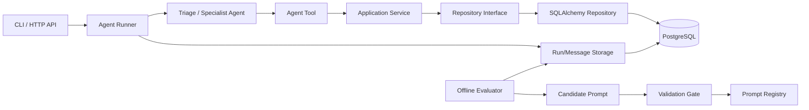

# 这个会话用于技术学习，现在我给你一张图片，你帮我寻找一下我应该怎么学

> 这个会话用于技术学习，现在我给你一张图片，你帮我寻找一下我应该怎么学
>
> User context
>
> Images:
> - `/var/folders/7s/r3kg7n3d19qc_tz_fcl4hzmh0000gn/T/codex-clipboard-44968633-0c1f-45be-af3a-afa63b685bd5.png`

<details><summary>4 previous messages</summary>

> 我会先核实图里的核心概念和 Hermes 资料，再整理成一条从基础到动手项目的学习路线，区分模型训练和 Agent 运行时改进。
>
> <details><summary>Searched the web</summary>
>
> Searched the web for `site.github.com/NousResearch hermes-agent self improving skills GEPA ...`
>
> </details>
>
> 为了把学习路线调整到适合你的起点，你目前更接近哪种情况？也可以补充你希望偏工程实战还是论文研究。
> - 会 Python，尚未做过 Agent 项目
> - 做过大模型 API／Agent 项目，想学自改进
> - 编程基础较少，希望从基础开始
>
> <details><summary>Searched the web</summary>
>
> Searched the web for `site.dspy.ai GEPA tutorial ...`
>
> Searched the web for `site.arxiv.org "Reinforced Self-Training" language modeling ...`
>
> Searched the web for `https://hermes-agent.nousresearch.com/docs/developer-guide/architecture/`
>
> </details>
</details>

建议你按这条顺序学习：**Agent 基础 → 评估 → 自我修正 → 记忆与 Skills → Hermes → GEPA 自动优化**。图里的模型微调论文可以放到后面。

我查了官方文档和相关论文。这张图适合作为知识地图，但它把几种不同的“学习”放在了一起，需要先拆开。

**先弄清楚：“进化”的究竟是什么？**

| 层次 | 改变的东西 | 直观例子 | 是否更新模型参数 |
|---|---|---|---|
| 单次任务改进 | 当前回答、执行方案 | 回答后检查错误，再修改 | 否 |
| 跨任务经验积累 | 记忆、Skill、提示词 | 把一次失败总结成操作规范，下次加载 | 通常否 |
| 模型训练 | 模型权重 | 把筛选后的生成数据用于微调 | 是 |

[Self-Refine](https://arxiv.org/abs/2303.17651)对应第一类；[Reflexion](https://arxiv.org/abs/2303.11366)通过保存反思文本影响后续尝试，连接到第二类；[STaR](https://arxiv.org/abs/2203.14465)则包含真正的模型微调。

**对于图中的 Hermes 项目，优先学第二类。**官方自进化仓库说明，它通过 API 调用优化 Skill 等文本，无需 GPU 训练。因此，入门时先掌握 Python、模型调用和评估，就能开始实践。[官方仓库](https://github.com/NousResearch/hermes-agent-self-evolution)

另外，图中有些内容要作为待验证材料看待：

- “L1–L6 渐进式披露”并非当前官方 Skills 文档的层级定义；官方目前按列表、完整 Skill、引用文件三个加载层次说明。学习重点是**按需加载上下文**。[Skills 文档](https://hermes-agent.nousresearch.com/docs/user-guide/features/skills/#progressive-disclosure)
- “22% → 70–90%”是图中项目声称的结果。缺少代码、数据和评估方法时，不能把它当作通用效果或学习验收目标。
- 官方自进化仓库目前将 Skill 优化列为已实现，而工具描述、系统提示词、代码等优化仍列为计划项；阅读时要区分实现与规划。[项目进度](https://github.com/NousResearch/hermes-agent-self-evolution#what-it-optimizes)

下面先按“**有一点 Python 基础，希望偏工程实战**”安排。时间仅作参考，每阶段以能完成练习为准。

**第一步：做出一个最小 Agent，约 3–5 天。**

学习模型 API、消息历史、工具调用、JSON、异常处理和停止条件。理解 Agent 如何重复执行：

`接收问题 → 决定调用工具 → 得到结果 → 继续处理或回答`

读 [ReAct 论文](https://arxiv.org/abs/2210.03629)，重点理解推理与行动如何交替，不必一开始推导所有实验。

练习可以沿用图中的电商场景：用本地假数据实现 `查询订单` 和 `查询售后规则` 两个工具，让 Agent 回答“这个订单能不能退货”。

验收标准：你能从日志中解释它为什么调用这个工具、工具返回了什么、在哪一步出错。若 Python 基础较少，先补函数、字典、文件读写、HTTP 请求和异常处理。

**第二步：先学会判断效果，约 3–5 天。**

这是整条路线最关键的一步。自动改进需要明确的反馈，否则很容易把“回答更像样”误认为“任务做得更好”。

给上面的客服 Agent 准备一批小型用例，覆盖正常情况、信息缺失和规则边界，记录：

| 评估内容 | 示例 |
|---|---|
| 结论是否正确 | 是否符合给定的退货规则 |
| 工具使用是否正确 | 是否查到了正确订单 |
| 信息是否充分 | 缺少订单号时是否先询问 |
| 是否编造 | 是否承诺了规则中没有的退款 |
| 成本 | 调用次数、token、耗时 |

建议先人工核对 20 条，确认评估规则可信，再扩大规模。**不要只靠关键词打分**：回答包含“可以退货”，并不能证明它判断正确。

**第三步：实现一次“回答—反馈—修正”，约 2–3 天。**

阅读：

- [Self-Refine](https://arxiv.org/abs/2303.17651)：如何根据反馈迭代当前回答。
- [Reflexion](https://arxiv.org/abs/2303.11366)：如何把反馈总结成经验，影响后续尝试。

在同一批练习题上比较：

1. 直接回答。
2. 得到具体错误反馈后，再修改一次。
3. 加载之前总结的经验，再回答新问题。

例如，把反馈写成“未查询订单签收时间，因此无法判断是否超过期限”，比只写“回答错误，请反思”更容易指导修改。

验收标准：你能展示哪些错误被修好了、哪些正确答案反而被改错了，以及多花了多少成本。

**第四步：把经验整理成 Skill，约 3–5 天。**

这里要区分：

- **记忆**：保存事实或状态，例如用户的偏好。
- **Skill**：保存可重复执行的方法，例如售后资格判断流程。

写一个售后 Skill，包含适用条件、操作步骤、例外和验证方式。比如：

> 判断退货资格前，先查询商品类别与签收时间；缺少订单号时先询问；对照规则给出结论与依据。

然后人为制造一个失败案例，修改 Skill，再检查其他案例是否退步。验收重点是：**新经验能否帮助未见过的问题，以及修改能否回滚。**

这时再读 [Hermes Skills 文档](https://hermes-agent.nousresearch.com/docs/user-guide/features/skills/)，理解 Skill 的发现、加载和修改机制，会更容易。

**第五步：带着问题读 Hermes，再接入 GEPA，约 1–2 周。**

读 [Hermes 架构文档](https://hermes-agent.nousresearch.com/docs/developer-guide/architecture/)时，沿着一次请求追踪：

`用户消息 → 上下文组装 → 工具执行 → 返回结果 → 经验保存 → 下次检索`

先关注 Agent Loop、Memory、Skills，消息平台适配等模块可以后学。

之后学 [DSPy GEPA 官方文档](https://dspy.ai/api/optimizers/GEPA/overview/)。GEPA 的核心是根据执行轨迹和文字反馈提出提示词修改，评估候选版本，并保留表现互补的候选。你需要理解的对象是：**待优化文本、任务数据、评分与反馈函数、候选选择机制**。

把前面手动修改 Skill 的过程自动化：

`运行练习集 → 收集失败 → 提出 Skill 修改 → 验证候选 → 保存选中的版本`

数据至少分成三部分：用于提出修改的训练集、用于选择版本的验证集，以及最终才使用的测试集。**反复用于调参的 Probe 集属于验证集，不能再充当独立测试证据。**

最终项目可以比较“无 Skill、人工 Skill、自动优化 Skill”三个版本，保持模型版本与调用设置一致，同时报告正确率和成本。能解释提升来自哪里，比复现图里的某个百分比更有价值。

**模型训练论文放在这之后，按兴趣选读。**

如果你想进一步研究“经验如何写入模型参数”，再补 SFT、LoRA、DPO，然后读：

| 资料 | 阅读时抓住的问题 |
|---|---|
| [STaR](https://arxiv.org/abs/2203.14465) | 如何生成并筛选用于微调的推理数据？ |
| [ReST](https://arxiv.org/abs/2308.08998) | 如何交替生成数据和改进模型？ |
| [Self-Rewarding LMs](https://arxiv.org/abs/2401.10020) | 模型怎样为训练提供评价信号？ |
| [SPIN](https://arxiv.org/abs/2401.01335) | 如何利用历史模型生成的回答和已有示范数据继续训练？ |

**你现在的第一项练习可以很小：写 10 条虚构售后规则、20 条问题，做一个能查询规则并回答的程序，保存它的错误。**这些错误会成为后续学习评估、反思、Skill 和自动优化的一套贯穿材料。

> 我应该怎么做一个自进化的Agent呢？帮我分步走，就是我应该先产考哪些agent

<details><summary>2 previous messages</summary>

> 我会把适合参考的 Agent 按实现顺序排好，并核对官方资料，明确每一步该看什么、自己做出什么。
>
> <details><summary>Searched the web</summary>
>
> Searched the web for `https://github.com/karpathy/minimal-agent`
>
> Searched the web for `https://huggingface.co/docs/smolagents/en/guided_tour`
>
> </details>
</details>

**先参考 smolagents，再看 Reflexion，然后看 Hermes，最后接 GEPA。**每看一个项目，就给自己的 Agent 增加一项能力，这样能逐步做出可验证的“自进化”。

第一版建议沿用图片里的**电商售后 Agent**：让它从回答错误中总结经验、修改 Skill，并在新问题上验证效果。模型参数保持固定，进化的对象是操作规则和 Skills。

下面是具体顺序。

| 顺序 | 参考项目 | 重点学什么 | 你要做出的版本 |
|---|---|---|---|
| 1 | [smolagents](https://github.com/huggingface/smolagents) | 工具调用、执行循环、日志 | V1：能完成任务 |
| 2 | [Reflexion](https://github.com/noahshinn/reflexion) | 失败反馈、反思、再次尝试 | V2：能从错误中修正 |
| 3 | [Hermes Agent](https://github.com/NousResearch/hermes-agent) | Skill 保存、检索、按需加载 | V3：能跨任务复用经验 |
| 4 | [Hermes Self-Evolution](https://github.com/NousResearch/hermes-agent-self-evolution) + [DSPy GEPA](https://dspy.ai/api/optimizers/GEPA/overview/) | 自动提出修改、评估候选、选择版本 | V4：能自动优化 Skill |

[Voyager](https://github.com/MineDojo/Voyager)作为选读：它很适合理解“把成功行为保存成技能并复用”，其中技能主要是可执行代码。完整运行需要 Minecraft 环境，可以先阅读其技能库设计。

**第 1 步：参考 smolagents，做一个能工作的 Agent。**

先看官方 [Guided tour](https://huggingface.co/docs/smolagents/en/guided_tour)，重点看 `ToolCallingAgent`、自定义工具和执行记录。它通过结构化工具调用连接 Python 函数，适合这个入门项目。

给自己的 Agent 配置两个工具：

```python
get_order(order_id)          # 查询本地模拟订单
get_return_policy(category) # 查询虚构售后规则
```

让它完成这样的任务：

> “订单 A001 的耳机已经签收 5 天，拆封了，可以退吗？”

你需要准备：

- 10 条虚构订单。
- 一份明确的售后规则。
- 20 条问题及预期结论。
- 每次执行的工具名、参数、返回值和最终回答。

**完成标准：**你能看懂一条完整执行记录，指出错误发生在查订单、查规则还是做判断的环节。此时得到 V1，并记录它在 20 条问题上的成绩。

**第 2 步：参考 Reflexion，让它根据错误反馈重试。**

先读仓库的反思策略说明，再看 `hotpotqa_runs` 里的示例和日志。它提供了“无反思”“带上次尝试”“带反思”等对照方式，适合学习如何验证反思是否有效。[Reflexion 官方实现](https://github.com/noahshinn/reflexion)

给你的项目增加两个模块：

```python
evaluate(case, result)       # 判断对错，返回具体错误
reflect(trace, feedback)    # 从执行记录和反馈中总结改进建议
```

例如：

```text
错误：把所有拆封商品都判断为不可退。
依据：本案例对应的虚构政策只限制特定商品类别。
建议：先查询类别对应规则，再判断拆封是否影响退货。
```

然后把建议交给 Agent，再尝试一次。

**完成标准：**对比同一批问题“第一次回答”和“反馈后回答”的正确率，并记录修正失败、越改越错的案例。

这一阶段先用人工核对过的答案或明确规则评估。反思模块可以调用同一个模型；评估标准应由你控制。

**第 3 步：参考 Hermes，把经验保存成可复用的 Skill。**

重点读 [Skills System](https://hermes-agent.nousresearch.com/docs/user-guide/features/skills/)，学习 Skill 的描述、加载和修改机制。Hermes 的 Skills 是可按需加载的过程文档。

把上一步得到的有效经验，整理为一个 `SKILL.md`：

```markdown
# 售后资格判断

适用范围：用户询问订单是否可以退货。

步骤：
1. 缺少订单号时先询问。
2. 查询订单，确认商品类别和签收时间。
3. 查询该类别对应的退货规则。
4. 检查期限、商品状态和例外条件。
5. 给出结论，并说明使用了哪条规则。

常见错误：
不要把某一类别的拆封限制推广到所有商品。
```

你的 Agent 每次接到售后问题时，加载这个 Skill。然后用**新的订单和问题**检查它是否还会犯原来的错误。

**完成标准：**重启程序后经验仍然存在，而且能够帮助新的相似任务。保存 Skill 的版本和修改原因，方便比较与回滚。

**第 4 步：先亲手写出最小“进化循环”。**

把已经做好的模块连接起来：

```text
当前 Skill
   ↓
运行练习集，记录失败
   ↓
根据失败生成候选 Skill
   ↓
在验证集上比较旧版与候选版
   ↓
满足预先设定的通过条件 → 保存为新版本
否则 → 保留旧版本
```

这里建议先只允许修改一个售后 Skill，控制好实验范围。

你需要把数据分开：

| 数据 | 用途 |
|---|---|
| 训练集 | 暴露错误，让模型提出 Skill 修改 |
| 验证集 | 比较候选版本，决定采用哪个 |
| 测试集 | 最终检查对未见问题的效果 |

同时固定模型版本和调用设置，记录正确率、成本及原本通过但修改后失败的案例。评分规则与最终测试答案放在优化器不能修改的位置。

**完成标准：**程序能自动完成“提出修改—比较效果—接受或放弃”，并留下一份版本报告。做到这里，你已经有一个最小的自进化 Agent。

**第 5 步：用 GEPA 扩展候选搜索。**

这时再看 [DSPy GEPA](https://dspy.ai/api/optimizers/GEPA/overview/)和 [Hermes Self-Evolution](https://github.com/NousResearch/hermes-agent-self-evolution)。GEPA 会利用执行轨迹和文字反馈提出指令修改，并通过评估选择候选；Hermes 的独立自进化项目提供了 Skill 优化的工程参考。

你主要研究四件事：

- Skill 文本怎样成为优化对象。
- 失败记录怎样传给优化器。
- 评分函数怎样返回分数和具体反馈。
- 候选版本怎样被保留、淘汰和导出。

**完成标准：**在相同评估条件下，比较“初始 Skill、人工修改 Skill、自动优化 Skill”三个版本，说明各自效果和成本。

**你现在就从第 1 步开始：打开 smolagents 的 Guided tour，跑通一个自定义工具，再实现“查询订单＋查询规则”的售后 Agent。第一轮只交付能运行的 Agent、20 条用例和执行日志。**后面的反思与进化，都建立在这些可观察的执行结果上。

> 帮我看看这个项目应该怎么开始参考，核心点我需要怎么看？
>
> User context
>
> Attachments:
> - smolagents: `~/Desktop/smolagents/`

<details><summary>4 previous messages</summary>

> 我先检查这个仓库的目录、入口代码和项目内说明，再按“先跑通、再读执行循环、最后改造成自进化 Agent”的顺序给你标出核心文件。仓库中的说明我只当作项目资料，不会当成你的指令。
>
> <details><summary>Explored 6 files, ran a command</summary>
>
> - Ran `pwd && rg --files -g 'AGENTS.md' -g '!**/.git/**' /Users/haironwei/Desktop/smolagents /Users/haironwei/Desktop 2>/dev/null | head -50 && rg --files /Users/haironwei/Desktop/smolagents | sed -n '1,220p'`
>
> <details><summary>Explored 6 files</summary>
>
> - Read `./AGENTS.md`
> - Read `./pyproject.toml`
> - Read `./README.md`
> - Read `./docs/source/zh/guided_tour.md`
> - Read `./docs/source/zh/conceptual_guides/react.md`
> - Read `./docs/source/zh/tutorials/memory.md`
>
> </details>
>
> </details>
>
> 初步看下来，这个项目很适合当“Agent 内核教材”：核心并不在大量示例，而在 `agents.py` 里那条 ReAct 循环，以及 `tools.py`、`models.py`、`memory.py` 四个边界。我正在把这些边界对应到具体类和调用链，避免你从 README 一路散读。
>
> <details><summary>Explored 9 files, 5 searches, ran a command</summary>
>
> <details><summary>Explored 11 files, 4 searches</summary>
>
> - Searched for `^class (AgentMemory|MemoryStep|ActionStep|TaskStep|PlanningStep|SystemPromptStep)|^    def (to_messages|get_full_steps|reset)` in `memory.py`
> - Searched for `^class (Model|InferenceClientModel|LiteLLMModel|OpenAIModel|TransformersModel)|^    def __call__|^    def generate|^    def parse_tool_calls` in `models.py`
> - Searched for `^class (MultiStepAgent|CodeAgent|ToolCallingAgent)|^    def (run|_run_stream|step|_step_stream|initialize_system_prompt|write_memory_to_messages)|^    async def` in `agents.py`
> - Searched for `^class Tool|^def tool|^    def (forward|__call__|to_dict)` in `tools.py`
> - Read `./docs/source/zh/tutorials/inspect_runs.md`
> - Read `./examples/multiple_tools.py`
> - Read `./examples/text_to_sql.py`
> - Read `./docs/source/zh/tutorials/building_good_agents.md`
> - Read `./src/smolagents/agents.py`
> - Read `./src/smolagents/agents.py`
> - Read `./src/smolagents/agents.py`
> - Read `./src/smolagents/agents.py`
> - Read `./src/smolagents/memory.py`
> - Read `./src/smolagents/prompts/toolcalling_agent.yaml`
> - Read `./src/smolagents/tools.py`
>
> </details>
>
> - Ran `git status --short && git log -1 --format='%h %cs %s' && python3 --version`
>
> <details><summary>Explored 5 files, a search</summary>
>
> - Read `./src/smolagents/agents.py`
> - Read `./src/smolagents/memory.py`
> - Read `./src/smolagents/agents.py`
> - Read `./src/smolagents/agents.py`
> - Read `./src/smolagents/models.py`
> - Searched for `step_callbacks|final_answer_checks|reset=False|get_full_steps|ToolCallingAgent\(` in `test_agents.py`
>
> </details>
>
> </details>
</details>

这个项目适合参考 **Agent 的运行内核**，但它本身不是完整的“自进化框架”。你应该从它学习：

`任务 → 模型决策 → 工具调用 → 环境反馈 → 写入轨迹 → 下一步决策`

然后在外层增加评估器、反思器和 Skill 版本管理，才能形成自进化闭环。

本地仓库是 `smolagents 1.27.0.dev0`，Python 要求 `>=3.10`。项目当前工作区是干净的。

## 推荐阅读顺序

### 1. 先运行一个 ToolCallingAgent

先读中文导览：[guided_tour.md](~/Desktop/smolagents/docs/source/zh/guided_tour.md)。

入门阶段建议先用 `ToolCallingAgent`。它输出结构化工具调用，执行过程更容易观察，也更适合后面加入评估和进化逻辑。

先不要运行联网搜索示例。自己写两个确定性工具：

```python
from smolagents import ToolCallingAgent, tool

ORDERS = {
    "A001": {
        "category": "headphones",
        "signed_days": 5,
        "opened": True,
    }
}

POLICIES = {
    "headphones": {
        "return_days": 7,
        "opened_allowed": False,
    }
}

@tool
def get_order(order_id: str) -> dict:
    """查询订单。

    Args:
        order_id: 订单编号。
    """
    return ORDERS.get(order_id, {"error": "订单不存在"})

@tool
def get_return_policy(category: str) -> dict:
    """查询商品类别对应的退货规则。

    Args:
        category: 商品类别。
    """
    return POLICIES.get(category, {"error": "规则不存在"})
```

然后配置你能使用的模型：

```python
agent = ToolCallingAgent(
    tools=[get_order, get_return_policy],
    model=model,
    max_steps=6,
    return_full_result=True,
)

result = agent.run("订单 A001 的耳机已经拆封，签收 5 天，可以退吗？")
print(result.output)
print(result.steps)
```

参考工具写法时，看 [tools.py](~/Desktop/smolagents/src/smolagents/tools.py:1061)。`@tool` 会从函数名、类型标注和 docstring 生成工具 Schema。

### 2. 读懂最核心的执行循环

最重要的文件是 [agents.py](~/Desktop/smolagents/src/smolagents/agents.py:268)。

按下面顺序读：

1. `MultiStepAgent.__init__`：模型、工具、记忆、回调怎样被组装。
2. `run()`：[agents.py](~/Desktop/smolagents/src/smolagents/agents.py:436)
3. `_run_stream()`：[agents.py](~/Desktop/smolagents/src/smolagents/agents.py:540)
4. `ToolCallingAgent._step_stream()`：[agents.py](~/Desktop/smolagents/src/smolagents/agents.py:1276)

其中 `_run_stream()` 是整个项目的心脏：

```text
创建 ActionStep
    ↓
调用 _step_stream()
    ↓
模型生成工具调用
    ↓
执行工具并取得 Observation
    ↓
把本步加入 memory
    ↓
没有 final_answer 就继续下一步
```

阅读时重点追踪这几个变量：

- `action_step`：本次执行的完整轨迹。
- `memory.steps`：此前所有任务、动作、观察和错误。
- `returned_final_answer`：循环终止条件。
- `final_answer_checks`：最终结果验证器。
- `step_callbacks`：每一步结束后的扩展点。

暂时忽略流式输出、多 Agent、图片、异步执行和远程沙箱，它们会干扰你理解主循环。

### 3. 理解“反馈为什么能让 Agent 自我纠错”

读 [memory.py](~/Desktop/smolagents/src/smolagents/memory.py:42)。

重点看：

- `TaskStep`：用户任务。
- `ActionStep`：模型输出、工具调用、观察和错误。
- `PlanningStep`：阶段性计划。
- `AgentMemory`：[memory.py](~/Desktop/smolagents/src/smolagents/memory.py:214)
- `write_memory_to_messages()`：[agents.py](~/Desktop/smolagents/src/smolagents/agents.py:758)

这里有一个很关键的机制：工具报错会被转成新的消息，提醒模型不要重复此前错误。也就是说，smolagents 已经具备**单次运行内自我修正**：

```text
工具调用失败
→ 错误写入 ActionStep
→ ActionStep 转成下一轮模型输入
→ 模型看到错误并尝试其他方法
```

但是程序重新启动后，这些经验不会自动变成长期能力。这正是你后面需要补的部分。

### 4. 对比 ToolCallingAgent 和 CodeAgent

读完前面内容后再看 [CodeAgent](~/Desktop/smolagents/src/smolagents/agents.py:1505)。

两者差异是：

| 类型 | 模型生成的动作 | 适合场景 |
|---|---|---|
| ToolCallingAgent | JSON 工具调用 | 业务 Agent、流程控制、初学 |
| CodeAgent | Python 代码 | 数据处理、复杂组合、研究实验 |

CodeAgent 会执行模型生成的 Python，因此还要理解 [local_python_executor.py](~/Desktop/smolagents/src/smolagents/local_python_executor.py)。README 也明确说明本地执行器不能当作真正的安全沙箱。

你的自进化 Agent 第一版用 `ToolCallingAgent` 即可。等评估系统稳定后，再比较 CodeAgent 是否能提高复杂任务表现。

## 如何在它上面做“自进化”

smolagents 已经给了你三个重要接口：

- `return_full_result=True`：取得完整执行轨迹。
- `final_answer_checks`：[agents.py](~/Desktop/smolagents/src/smolagents/agents.py:613)，阻止不合格答案结束。
- `step_callbacks`：[agents.py](~/Desktop/smolagents/src/smolagents/agents.py:620)，在每一步结束后收集数据。

你需要在外面补四个模块：

```text
Agent Runtime     smolagents 负责执行任务
Evaluator         根据标准答案和规则评分
Reflector         分析失败轨迹，形成具体经验
Skill Manager     保存、加载、修改和回滚经验
```

最小闭环可以这样写：

```python
for case in training_cases:
    result = agent.run(case["question"], return_full_result=True)

    score, feedback = evaluator(
        expected=case["expected"],
        result=result,
    )

    if score < 1:
        lesson = reflector(
            trajectory=result.steps,
            feedback=feedback,
        )
        skill_manager.propose_patch(lesson)

candidate_skill = skill_manager.build_candidate()

old_score = evaluate_dataset(current_skill, validation_cases)
new_score = evaluate_dataset(candidate_skill, validation_cases)

if new_score > old_score:
    skill_manager.activate(candidate_skill)
```

这里进化的是 Skill 文本或 Agent 指令，不是模型权重。

## 最适合你的实际改造顺序

第一阶段只完成售后 Agent：

- 两个工具。
- 20 条测试问题。
- 保存完整轨迹。
- 输出基础正确率。

第二阶段加入 `Evaluator`：

- 判断结论是否正确。
- 检查有没有调用必要工具。
- 检查回答是否引用了正确规则。
- 返回具体失败原因。

第三阶段加入 `Reflector`：

```text
失败原因：
Agent 只根据签收天数判断，没有检查拆封限制。

建议经验：
处理耳机退货前，必须同时检查签收天数和拆封状态。
```

第四阶段加入 Skill 文件：

```markdown
# 售后判断 Skill

## 步骤
1. 查询订单。
2. 获取商品类别、签收时间和商品状态。
3. 查询该类别政策。
4. 逐项检查限制条件。
5. 给出结论和规则依据。

## 已知错误
不能只检查退货期限，还要检查拆封状态。
```

第五阶段实现候选版本比较，只在验证集成绩提升且没有明显回退时替换旧 Skill。

## 暂时不用看的内容

第一轮可以先跳过：

- `remote_executors.py`
- `mcp_client.py`
- `serialization.py`
- `vision_web_browser.py`
- `gradio_ui.py`
- `examples/open_deep_research`
- 多 Agent 示例
- 遥测平台接入

你现在的第一目标是读懂并亲手复现这一条链路：

`agent.run()` → `_run_stream()` → `_step_stream()` → `model.generate()` → `process_tool_calls()` → `ActionStep` → 下一轮。

一旦这条链路完全清楚，smolagents 就不再是一个黑盒，你也就有了添加自进化层的准确位置。

> 有没有使用openai agent sdk 或者langchian/langgraph 的项目，我想用者俩个框架

<details><summary>4 previous messages</summary>

> 有，而且这两个方向都能搭出你前面说的“自进化 Agent”。我会用 OpenAI 官方资料技能核对 Agents SDK，再对照 LangChain/LangGraph 的官方示例，最后给你一个明确的选择顺序和可参考项目。
>
> <details><summary>Searched the web</summary>
>
> <details><summary>Explored a file</summary>
>
> - Read `~/.codex/skills/.system/openai-docs/SKILL.md`
>
> </details>
>
> Searched the web for `site:developers.openai.com Agents SDK Python tools handoffs guardrails sessions tracing examples`
>
> Searched the web for `site:developers.openai.com/api/docs/guides agents sdk python handoffs guardrails tracing ...`
>
> Searched the web for `site:github.com/openai/openai-agents-python examples agents sdk official ...`
>
> Searched the web for `site:docs.langchain.com/oss/python/langgraph overview persistence memory human-in-the-loop ...`
>
> </details>
>
> 已经确认了两个合适的入口：OpenAI Agents SDK 更适合先学“Agent、工具、Guardrail、Handoff、Tracing”；LangGraph 更适合实现你要的“生成 → 评估 → 反思 → 修改 Skill → 再验证”有状态循环。接下来我会把具体仓库按难度筛成少量必看项目。
>
> <details><summary>Searched the web</summary>
>
> Searched the web for `site:github.com/openai/openai-agents-python/tree/main/examples customer service research agent ...`
>
> Searched the web for `https://github.com/openai/openai-agents-python/blob/main/examples/agent_patterns/llm_as_a_judge.py`
>
> </details>
</details>

有。针对“自进化 Agent”，我建议你按这个顺序学习：

1. **OpenAI Agents SDK**：学会构建一个可靠的执行 Agent。
2. **LangGraph**：学会设计评估、反思、重试和长期记忆循环。
3. 最后组合：Agents SDK 负责完成任务，LangGraph 负责控制进化流程。

不要一开始就把两个框架混在同一个程序里。先用同一个“电商售后 Agent”分别实现两遍，会更容易看清它们各自解决什么问题。

## OpenAI Agents SDK：按这几个项目看

主仓库：[openai/openai-agents-python](https://github.com/openai/openai-agents-python)

OpenAI Agents SDK 的核心对象很少：`Agent`、`Runner`、Tool、Handoff、Guardrail、Session 和 Trace。SDK 默认使用 Responses API，并负责工具调用、运行循环、交接和会话状态等编排工作。[官方 OpenAI 文档](https://developers.openai.com/api/docs/guides/latest-model?model=gpt-5.5)

建议按以下顺序阅读。

### 1. basic/tools.py

[基础工具示例](https://github.com/openai/openai-agents-python/blob/main/examples/basic/tools.py)

重点看：

```python
@function_tool
def get_order(order_id: str) -> str:
    ...

agent = Agent(
    name="售后客服",
    instructions="根据订单和售后政策判断是否可以退货。",
    tools=[get_order],
)

result = Runner.run_sync(agent, "查询订单 A001")
```

对应你在 smolagents 里看到的：

| smolagents | OpenAI Agents SDK |
|---|---|
| `@tool` | `@function_tool` 或 `@tool` |
| `ToolCallingAgent` | `Agent` |
| `agent.run()` | `Runner.run()` |
| `ActionStep` | `RunResult.new_items` |
| Agent 日志 | Tracing |

### 2. deterministic.py

[确定性流程示例](https://github.com/openai/openai-agents-python/blob/main/examples/agent_patterns/deterministic.py)

这个示例展示：

```text
生成结果 → 检查结果 → 根据检查结果继续或结束
```

它很适合学习“业务流程由 Python 控制，模型只负责需要智能的部分”。

例如：

```python
answer = await Runner.run(customer_agent, question)
evaluation = await Runner.run(evaluator_agent, answer.final_output)

if evaluation.final_output.passed:
    return answer
```

### 3. llm_as_a_judge.py

[LLM-as-a-Judge 示例](https://github.com/openai/openai-agents-python/blob/main/examples/agent_patterns/llm_as_a_judge.py)

这是最接近自我改进循环的官方示例：

```text
Generator 生成结果
    ↓
Evaluator 评分并给出反馈
    ↓
通过？──是──→ 结束
  │
  否
  ↓
把反馈交回 Generator
```

官方示例已经包含结构化评估结果：

```python
@dataclass
class EvaluationFeedback:
    feedback: str
    score: Literal["pass", "needs_improvement", "fail"]
```

你可以把故事生成替换成售后任务：

- `customer_agent`：判断是否可以退货。
- `evaluator_agent`：检查结论、工具调用和政策依据。
- 反馈不通过时重新回答。

不过，这个示例改善的是**当前答案**，还没有修改长期 Skill。

### 4. customer_service

[客服 Agent 项目](https://github.com/openai/openai-agents-python/tree/main/examples/customer_service)

这是最适合你改造的完整项目。它展示了：

- Triage Agent 进行意图分类。
- FAQ Agent 回答政策问题。
- Seat Booking Agent 执行业务操作。
- Handoff 在 Agent 之间移交会话。
- Context 保存业务状态。
- Trace 记录完整执行过程。

你可以把它改造成：

```text
售后分流 Agent
├── 订单查询 Agent
├── 退货规则 Agent
└── 售后处理 Agent
```

但第一版只保留“售后 Agent＋两个工具”即可。自进化早期不需要多 Agent。

### 5. research_bot

[Research Bot](https://github.com/openai/openai-agents-python/tree/main/examples/research_bot)

这个项目包含：

```text
规划 → 并行搜索 → 汇总 → 写报告
```

官方 README 也建议为它增加评估步骤，让 Agent 判断是否需要继续搜索或改善结果。它适合你学完售后项目后，再研究复杂任务中的循环和多 Agent。

---

## LangGraph：重点看这几个内容

主仓库：[langchain-ai/langgraph](https://github.com/langchain-ai/langgraph)

LangChain 和 LangGraph 的定位不同：

- **LangChain**：模型、Prompt、Tool、Retriever 等组件。
- **LangGraph**：用状态图组织循环、分支、持久化和中断。

自进化的控制逻辑主要放在 LangGraph。

### 1. LangGraph Quickstart

先跑通 [官方 Quickstart](https://docs.langchain.com/oss/python/langgraph/quickstart)。

重点掌握四个概念：

```python
class State(TypedDict):
    ...

builder = StateGraph(State)
builder.add_node(...)
builder.add_edge(...)
builder.add_conditional_edges(...)
graph = builder.compile()
```

不要急着使用预构建的 `create_agent`。先亲手写一个三节点图：

```text
START → generate → evaluate
                    ↓
              pass / improve
                    ↓
              END / generate
```

### 2. Evaluator-Optimizer

重点参考 [官方 Workflows + Agents 中的 Evaluator-Optimizer](https://docs.langchain.com/oss/python/langgraph/workflows-agents#evaluator-optimizer)。

它已经给出了最小反馈循环：

```python
optimizer_builder.add_edge(START, "generator")
optimizer_builder.add_edge("generator", "evaluator")

optimizer_builder.add_conditional_edges(
    "evaluator",
    route_result,
    {
        "Accepted": END,
        "Rejected": "generator",
    },
)
```

这是你做自进化 Agent 最应该先复现的 LangGraph 示例。

第一遍让它改进回答；第二遍才让它修改 Skill。

### 3. Persistence 和 Memory

阅读：

- [Persistence](https://docs.langchain.com/oss/python/langgraph/persistence)
- [Memory](https://docs.langchain.com/oss/python/concepts/memory)

LangGraph 把存储分成两类：

| 机制 | 保存内容 | 在你的项目里用于 |
|---|---|---|
| Checkpointer | 单次线程的图状态 | 当前生成、评价、反馈、迭代次数 |
| Store | 跨线程长期数据 | 经验、失败案例、Skill 版本 |

这正好对应自进化 Agent 的两种记忆：

```text
短期状态：这次任务试了什么、哪里失败
长期经验：以后遇到这种问题应该遵守什么规则
```

### 4. deep_research_from_scratch

项目：[langchain-ai/deep_research_from_scratch](https://github.com/langchain-ai/deep_research_from_scratch)

这是一个教学性很好的 LangGraph 项目，按 Notebook 逐步增加能力：

1. 需求澄清和结构化输出。
2. ReAct 工具调用循环。
3. MCP 工具。
4. Supervisor 与并行研究 Agent。
5. 完整图组合。

你重点看 Notebook 1、2、4、5。它不是自进化系统，但很适合学习状态、条件路由、子图和复杂工作流。

### 5. langgraph-reflection 只读设计

项目：[langgraph-reflection](https://github.com/langchain-ai/langgraph-reflection)

它实现了：

```text
主 Agent → Critique Agent → 有问题则重试 → 无问题则结束
```

不过这个仓库已于 **2026 年 4 月归档**，不建议作为新项目依赖。可以阅读其中 `llm_as_a_judge.py` 和代码验证示例，理解结构后，用当前 LangGraph 自己实现。[仓库状态与架构](https://github.com/langchain-ai/langgraph-reflection)

## 最终组合方式

等你分别跑通两个框架后，可以采用这种结构：

```text
LangGraph：进化控制器
│
├── run_agent
│      └── OpenAI Agents SDK Agent + Runner
│
├── evaluate
│      ├── 确定性规则
│      └── Evaluator Agent
│
├── reflect
│      └── 分析失败轨迹
│
├── propose_skill
│      └── 生成候选 SKILL.md
│
├── validate_skill
│      └── 在验证集上比较新旧版本
│
└── accept_or_reject
       ├── 接受并保存版本
       └── 拒绝并保留旧版本
```

其中：

- OpenAI Agents SDK 负责工具调用、业务 Agent、结构化结果和 Trace。
- LangGraph 负责节点、循环、条件边、检查点和长期 Store。
- Skill 使用普通 Markdown 或 JSON 文件管理。
- 评估数据分为训练集、验证集和最终测试集。

你的学习顺序可以直接定为：

1. OpenAI `basic/tools.py`
2. OpenAI `deterministic.py`
3. OpenAI `llm_as_a_judge.py`
4. 把 `customer_service` 改成售后 Agent
5. LangGraph Quickstart
6. LangGraph Evaluator-Optimizer
7. LangGraph Persistence/Store
8. 用 LangGraph 包住售后 Agent，自动提出并验证 Skill 修改

这条路线完成后，你做出来的就不只是会反复修改答案的 Agent，而是一个能从批量失败中生成候选经验、验证效果并管理版本的最小自进化系统。

> 看这段代码，这是我通过customer\_service进行改造的，我想学习这个项目的思路，并且进行完善
>
> User context
>
> Attachments:
> - from __future__ import annotations as _annotations import asyncio import random…: `~/.codex/attachments/1a011fcb-07bb-4e66-9285-77dd978154b3/pasted-text.txt`

<details><summary>15 previous messages</summary>

> 我会用 OpenAI 官方 Agents SDK 资料核对 `Agent / Runner / handoff / context / trace` 的正确用法，然后逐段审查你的改造代码。接着我会把它拆成“架构思路、当前问题、分阶段完善方案”，如果代码边界清楚，也会整理出可以直接落地的改造版本。
>
> <details><summary>Explored a file, searched the web</summary>
>
> <details><summary>Explored a file</summary>
>
> - Read `~/.codex/skills/.system/openai-docs/SKILL.md`
>
> </details>
>
> Searched the web for `site:developers.openai.com Agents SDK Python handoffs context sessions tracing tools`
>
> <details><summary>Explored a file</summary>
>
> - Read `~/.codex/attachments/1a011fcb-07bb-4e66-9285-77dd978154b3/pasted-text.txt`
>
> </details>
>
> </details>
>
> 这段代码已经抓住了示例的主线：分诊 Agent 负责路由，FAQ/座位 Agent 负责专门任务，`context` 保存业务状态，`result.last_agent` 延续会话。当前最大的完善点不是继续加 Agent，而是把“随机模拟状态、字符串 FAQ、无限历史和缺少验证”改成可测试、可追踪的业务边界。
>
> <details><summary>Ran a command, searched the web</summary>
>
> Searched the web for `site:developers.openai.com Agents SDK Python SQLiteSession Runner session ...`
>
> - Ran `rg --files -g 'AGENTS.md' -g '!work/**' -g '!outputs/**' . .. 2>/dev/null | head -30; ls -la`
>
> Searched the web for `site:github.com/openai/openai-agents-python OpenAIChatCompletionsModel openai_client example`
>
> </details>
>
> 我会给你一份可运行的“第二版”作为学习材料，重点做四件事：把业务规则从 Agent 提示词中拆出来、让交接只负责路由、让工具成为唯一的数据读写入口、给纯业务逻辑补上可离线测试。这样你能分清哪些是 Agents SDK，哪些是自己的业务系统。
>
> <details><summary>Created 4 files, ran a command</summary>
>
> - Ran `mkdir -p outputs/customer_service_improved`
> - Wrote `./outputs/customer_service_improved/README.md` (+73 -0)
> - Wrote `./outputs/customer_service_improved/app.py` (+275 -0)
> - Wrote `./outputs/customer_service_improved/domain.py` (+103 -0)
> - Wrote `./outputs/customer_service_improved/test_domain.py` (+37 -0)
>
> </details>
>
> Context compaction
>
> Source: automatic
> Status: completed
>
> 改进版已经整理成一个可运行的小项目。接下来我会做离线测试和语法检查，再按“先理解什么、再改什么、如何逐步加入自进化”的顺序给你讲清楚。
>
> <details><summary>Explored a search, ran 2 commands</summary>
>
> <details><summary>Explored a search</summary>
>
> - Searched for `^class |^def |^async def |Agent\[|function_tool|handoff\(|Runner\.run|DEFAULT_MODEL|^# ` in `README.md`
>
> </details>
>
> - Ran `python3 -m py_compile domain.py app.py test_domain.py`
>
> - Ran `python3 -m unittest -v test_domain.py`
>
> </details>
>
> 离线验证已通过：6 个领域测试全部成功，三个 Python 文件也能通过语法编译。现在我再核对关键实现位置，确保学习路径能直接对应到代码，而不是只给概念。
>
> <details><summary>Explored 4 files, ran a command</summary>
>
> <details><summary>Explored 3 files</summary>
>
> - Read `./app.py`
> - Read `./domain.py`
> - Read `./README.md`
>
> </details>
>
> - Ran `python3 -c "import agents; print(getattr(agents, '__version__', 'agents-import-ok'))"`
>
> <details><summary>Explored a file</summary>
>
> - Read `~/.codex/attachments/1a011fcb-07bb-4e66-9285-77dd978154b3/pasted-text.txt`
>
> </details>
>
> </details>
>
> 代码目前还缺少两样适合学习和继续演进的材料：明确的阅读顺序，以及固定的评估样例。我会把它们补进项目，并加入依赖清单；这样你可以先跑稳定基线，再开始做 Evaluator 和自动改进。
>
> <details><summary>Created 2 files, edited a file, explored a search, ran a command</summary>
>
> - Wrote `./outputs/customer_service_improved/README.md` (+36 -1)
> - Wrote `./outputs/customer_service_improved/eval_cases.json` (+38 -0)
> - Wrote `./outputs/customer_service_improved/requirements.txt` (+3 -0)
>
> <details><summary>Explored a search</summary>
>
> - Searched for `^## |^# |^MODEL_NAME|^class AirlineAgentContext|^def build_model|^def faq_lookup|^def lookup_booking|^def list_available_seats|^def update_seat|^async def on_seat_booking_handoff|^def build_agents|^async def main` in `README.md`
>
> </details>
>
> - Ran `python3 -m json.tool eval_cases.json >/dev/null && python3 -m unittest -v test_domain.py && python3 -m py_compile domain.py app.py test_domain.py`
>
> </details>
>
> 最后一个结论已经明确：这份代码适合作为 OpenAI Agents SDK 的第一阶段练习，但还不能称为“自进化 Agent”。它现在具备了可测试的业务基线；自进化应从轨迹评估开始，而不是让线上 Agent 直接改自己的提示词。
>
> <details><summary>Searched the web</summary>
>
> Searched the web for `site:developers.openai.com Agents SDK handoffs tools context sessions tracing`
>
> </details>
</details>

我已经把你的代码整理成一个更适合学习、运行和继续扩展的版本。

项目入口：[README.md](./outputs/customer_service_improved/README.md:1)

### 先理解项目的核心链路

```text
用户
  → Triage Agent 判断意图
  → Handoff 给专业 Agent
  → 专业 Agent 调用 Tool
  → Tool 操作业务数据
  → Agent 根据工具结果回答
```

其中：

- **Agent** 负责判断和组织语言。
- **Handoff** 只负责转交控制权。
- **Tool** 是 Agent 操作业务系统的唯一入口。
- **Context** 保存当前会话中已经验证的状态。
- **Repository/数据库** 才是订单、航班、座位等事实来源。
- **Runner** 执行推理、工具调用和 Handoff 循环。

### 原代码的主要问题

我重点修复了这些地方：

1. Handoff 时随机生成航班号，会制造虚假业务数据。
2. `update_seat` 只是修改 Context，没有验证确认号和座位库存。
3. 使用 `assert` 处理业务错误，无法稳定地返回给 Agent。
4. FAQ 关键词过于宽泛，未命中时容易诱发模型自行回答。
5. 没有最大循环次数、重置命令和稳定的异常处理。
6. 模型配置依赖全局状态，不方便测试和替换。
7. 没有固定评估集，无法判断一次 Prompt 修改究竟是变好还是变差。

### 推荐阅读顺序

1. 先看 [domain.py](./outputs/customer_service_improved/domain.py:22)，理解业务数据、校验和座位更新。
2. 再看 [app.py 的工具部分](./outputs/customer_service_improved/app.py:56)，理解模型如何查询和修改业务。
3. 看 [Agent 定义](./outputs/customer_service_improved/app.py:150)，比较 Triage、FAQ 和 Seat Booking 的职责。
4. 看 [Handoff 配置](./outputs/customer_service_improved/app.py:195)，理解 Agent 之间如何转交。
5. 最后看 [多轮运行循环](./outputs/customer_service_improved/app.py:227)，理解 `context`、`last_agent` 和对话历史。

OpenAI 当前也建议用 Agents SDK 处理工具编排、Handoff、状态管理和追踪，并明确工具的输入、副作用和错误行为。[官方 Agent 指南](https://developers.openai.com/api/docs/guides/latest-model?model=gpt-5.5)

### 如何运行

依赖在 [requirements.txt](./outputs/customer_service_improved/requirements.txt:1)。

```bash
cd /Users/haironwei/Documents/Codex/2026-09-10/ji-s/outputs/customer_service_improved

python -m venv .venv
source .venv/bin/activate
pip install -r requirements.txt

export DEEPSEEK_API_KEY="你的密钥"
export DEEPSEEK_MODEL="deepseek-chat"

python app.py
```

测试账号：

```text
ABC123
XYZ789
```

可以依次输入：

```text
我想换座位
确认号是 ABC123
有哪些空座位？
换到 5A
```

### 自进化应该怎样加入

目前这是“可靠 Agent 基线”，还不是自进化 Agent。下一步建议：

```text
固定评估集
→ 运行 Agent
→ 保存路由、工具调用和最终状态
→ Evaluator 分类失败
→ 生成候选 Prompt/FAQ 修改
→ 在验证集比较新旧版本
→ 达标后发布，并保留回滚版本
```

我已经准备了第一批测试场景：[eval_cases.json](./outputs/customer_service_improved/eval_cases.json:1)。

先评估四件事：

- 是否转给正确 Agent。
- 是否调用了必要工具。
- 工具失败后是否仍声称成功。
- 最终 Context 是否符合预期。

不要一开始就让线上 Agent 自动重写并启用自己的 Prompt。应先让 Evaluator 输出 `routing_error`、`missing_tool`、`bad_tool_arguments`、`unsupported_claim` 等结构化失败类型，再离线产生和验证候选修改。

如果之后用 LangGraph 重写，对应关系是：

| OpenAI Agents SDK | LangGraph |
|---|---|
| Agent | Node |
| Handoff | Conditional Edge / Command |
| Context | Graph State |
| Runner | Graph execution |
| 对话历史 | Checkpointer |
| Tool | Tool Node |

建议先把这个 Agents SDK 版本学透，再使用同一个 `domain.py` 实现 LangGraph 版，这样能直接比较两个框架的编排思路。

离线验证已经完成：6 个领域测试全部通过，JSON 和 Python 语法检查通过。当前环境尚未安装 `openai-agents`，所以没有执行真实 DeepSeek 模型调用。

> 我有项目地址，由于我现在是学习阶段，所以我不需要你帮我操作，你告诉我字幕操作就行了
>
> User context
>
> Attachments:
> - self-evolving: `~/Desktop/self-evolving/`

<details><summary>2 previous messages</summary>

> 明白，这次我只做只读分析，不修改、安装或运行项目。我会先查看 `self-evolving` 的目录、README 和入口文件，再给你一套可以自己照着执行的学习步骤，每一步都说明“看什么、运行什么、验证什么”。
>
> <details><summary>Explored 3 files, a search, ran a command</summary>
>
> - Ran `pwd && rg --files -g '!*__pycache__*' -g '!*.pyc' | sed -n '1,240p'`
>
> <details><summary>Explored 3 files, a search</summary>
>
> - Read `./README.md`
> - Read `./src/main.py`
> - Read `./src/auto_model.py`
> - Searched for `./.git/*` in `.`
>
> </details>
>
> </details>
</details>

明白。我理解你说的“字幕操作”是“逐步操作”。这次我只读了项目，没有修改或运行任何内容。

你这个项目目前很小：

```text
self-evolving/
├── src/
│   ├── main.py          # Agent、Tool、Handoff、运行循环
│   └── auto_model.py    # 自动输入辅助函数
├── examples/
└── README.md            # 目前为空
```

它现在是一个 **多 Agent 客服 Demo**，还不是“自进化 Agent”。正确学习顺序是先让客服 Agent 稳定运行，再添加评估与改进循环。

## 第一阶段：先运行现有项目

你自己执行：

```bash
cd /Users/haironwei/Desktop/self-evolving

python3 -m venv .venv
source .venv/bin/activate

pip install openai-agents openai pydantic
export DEEPSEEK_API_KEY="你的密钥"

python src/main.py
```

注意检查 `src/main.py` 中的模型：

```python
model="deepseek-flash"
```

应该改成你的 DeepSeek 账号实际支持的模型，例如：

```python
model="deepseek-chat"
```

第一次只测试下面几组输入：

```text
机上有 Wi-Fi 吗？
```

观察是否发生：

```text
Triage Agent
→ FAQ Agent
→ faq_lookup_tool
→ 最终回复
```

然后测试座位变更：

```text
我想换座位
确认号是 ABC123
我要换到 5A
```

观察是否发生：

```text
Triage Agent
→ Seat Booking Agent
→ update_seat
```

最后测试边界问题：

```text
我想退票
宠物可以登机吗？
你好
```

记录 Agent 是否出现反复 Handoff、随意回答或错误调用工具。

## 第二阶段：看懂五个核心概念

按这个顺序阅读 [main.py](~/Desktop/self-evolving/src/main.py)。

### 1. Context

```python
class AirlineAgentContext(BaseModel):
    passenger_name: str | None = None
    confirmation_number: str | None = None
    seat_number: str | None = None
    flight_number: str | None = None
```

Context 是当前会话的工作状态，不应该充当数据库。

例如：

```text
用户已经验证的确认号
当前正在处理的意图
已经查询到的航班号
```

可以放入 Context。

座位库存、真实订单、退款结果等业务事实应该存放在数据库或 Repository 中。

### 2. Tool

目前有两个工具：

```python
faq_lookup_tool
update_seat
```

Tool 的作用是让模型访问确定性的业务能力。

当前 `update_seat` 只是修改 Context：

```python
context.context.confirmation_number = confirmation_number
context.context.seat_number = new_seat
```

它没有真的更新业务数据。你的第一次完善应该是增加一个模拟订单仓库：

```python
BOOKINGS = {
    "ABC123": {
        "flight_number": "MU5101",
        "seat_number": "8A",
    }
}
```

然后拆成三个工具：

```python
lookup_booking(confirmation_number)
list_available_seats(confirmation_number)
update_seat(confirmation_number, new_seat)
```

正确顺序应该是：

```text
验证确认号
→ 查询空座
→ 用户选择
→ 更新座位
→ 工具返回成功
→ Agent 才能告诉用户成功
```

### 3. Handoff

当前路由关系是：

```text
             ┌→ FAQ Agent ─────────┐
Triage Agent ┤                      ├→ Triage Agent
             └→ Seat Booking Agent ┘
```

Handoff 只代表“换一个 Agent 继续处理”。

当前代码在 Handoff 时随机生成航班号：

```python
flight_number = f"FLT-{random.randint(100, 999)}"
```

这部分应该删除。航班号必须由 `lookup_booking` 从业务数据中查询，不能随机生成。

### 4. Agent instructions

三个 Agent 的职责应明确限制：

- `Triage Agent`：只分类和转交。
- `FAQ Agent`：只根据 FAQ 工具回答。
- `Seat Booking Agent`：只处理座位查询与变更。

Seat Booking Agent 的 instructions 可以按照结果约束来写：

```text
1. 没有确认号时，只询问确认号。
2. 收到确认号后必须先调用 lookup_booking。
3. 查询失败时不能继续修改座位。
4. 没有目标座位时，调用 list_available_seats。
5. 只有 update_seat 返回 SUCCESS，才能宣称更新成功。
6. 其他问题转回 Triage Agent。
```

这种写法比单纯写“你是一个座位客服”稳定得多。

### 5. Runner

运行循环中最重要的是：

```python
result = await Runner.run(
    current_agent,
    input_items,
    context=context,
)

input_items = result.to_input_list()
current_agent = result.last_agent
```

含义是：

- `to_input_list()` 保存上一轮对话和工具结果。
- `last_agent` 让下一轮从当前专业 Agent 继续。
- `context` 保存结构化会话状态。

建议增加最大步数：

```python
result = await Runner.run(
    current_agent,
    input_items,
    context=context,
    max_turns=10,
)
```

这样可以防止 Agent 之间无限转交。

## 第三阶段：把业务和 Agent 分开

建议你手动调整成下面的目录：

```text
self-evolving/
├── src/
│   ├── app.py              # 程序入口
│   ├── agents.py           # 三个 Agent
│   ├── tools.py            # Agent 工具
│   ├── domain.py           # 订单和座位业务规则
│   ├── models.py           # Context、Booking 等模型
│   └── config.py           # 模型和环境变量
├── tests/
│   ├── test_domain.py
│   └── test_tools.py
├── evals/
│   └── cases.json
├── requirements.txt
└── README.md
```

依赖关系应该保持：

```text
Agent → Tool → Domain/Repository
```

不要让 `domain.py` 反向依赖 Agent SDK。这样即使以后改用 LangGraph，业务代码也可以原样复用。

## 第四阶段：建立评估基线

创建 `evals/cases.json`，先写五种案例：

```json
[
  {
    "input": "机上有 Wi-Fi 吗？",
    "expected_agent": "FAQ Agent",
    "required_tools": ["faq_lookup_tool"]
  },
  {
    "input": "我想换座位",
    "expected_agent": "Seat Booking Agent",
    "expected_behavior": "ask_confirmation_number"
  },
  {
    "input": "确认号是错误的 BAD999",
    "required_tools": ["lookup_booking"],
    "forbidden_tools": ["update_seat"]
  },
  {
    "input": "宠物能进入客舱吗？",
    "required_tools": ["faq_lookup_tool"],
    "expected_behavior": "state_not_covered"
  }
]
```

先评估四项：

1. 路由是否正确。
2. 必须调用的工具是否调用。
3. 不该调用的工具是否被调用。
4. 工具失败后，Agent 是否仍然声称成功。

没有这个固定评估集，就无法判断 Prompt 修改究竟是优化还是退化。

## 第五阶段：加入 Evaluator Agent

等业务基线稳定后，再增加第四个 Agent：

```text
Evaluator Agent
```

它不参与客服对话，只在对话结束后读取运行轨迹，输出结构化结果：

```json
{
  "passed": false,
  "failure_type": "missing_tool",
  "reason": "座位更新前没有验证确认号",
  "suggested_target": "seat_booking_agent.instructions"
}
```

失败类型可以先限制为：

```text
routing_error
missing_tool
bad_tool_arguments
unsupported_claim
handoff_loop
incorrect_final_state
```

Evaluator 不应该直接修改线上 Prompt。

## 第六阶段：实现安全的“自进化”

你的进化循环可以这样设计：

```text
固定训练案例
→ 运行当前 Agent
→ 收集失败轨迹
→ Evaluator 分类失败
→ Optimizer 生成候选 instructions
→ 在验证集运行新旧两个版本
→ 新版本显著更好才保存
→ 人工确认后发布
```

建议保存版本：

```text
prompts/
├── triage_v1.txt
├── triage_v2_candidate.txt
├── seat_booking_v1.txt
└── manifest.json
```

`manifest.json` 记录：

```json
{
  "active_version": "v1",
  "candidate_version": "v2",
  "baseline_score": 0.72,
  "candidate_score": 0.86
}
```

学习阶段先保留人工发布环节，不要让真实客服会话直接改写并启用自己的 Prompt。

你的近期学习目标可以定为：

```text
第一周：跑通 Agent、Tool、Handoff、Context
第二周：拆出业务层并加入测试
第三周：建立 eval_cases 和轨迹记录
第四周：实现 Evaluator Agent
第五周：生成候选 Prompt 并比较新旧版本
```

先完成前三阶段，这个项目就会从“能演示的 Agent”变成“可以度量和持续改进的 Agent”。

> ok ，现在我先给这个项目改一个名字，然后在github上建立仓库

建议项目名改为：

```text
evolving-agent-lab
```

这个名字符合当前状态：用于学习 Agent、评估和自进化循环，还不是生产系统。

### 1. 重命名本地目录

```bash
cd /Users/haironwei/Desktop
mv self-evolving evolving-agent-lab
cd evolving-agent-lab
```

### 2. 添加 `.gitignore`

在项目根目录创建 `.gitignore`：

```gitignore
# Python
__pycache__/
*.py[cod]
.pytest_cache/

# Virtual environment
.venv/
venv/

# Secrets
.env
.env.*
*.key

# IDE
.vscode/
.idea/
.DS_Store

# Logs and evaluation output
logs/
traces/
eval_results/
```

特别注意：不要把 `DEEPSEEK_API_KEY`、`.env` 或其他密钥提交到 GitHub。

### 3. 补充 README

你现在的 `README.md` 是空的，可以先写最小版本：

```markdown
# Evolving Agent Lab

一个用于学习多 Agent 编排、工具调用、评估和自进化循环的实验项目。

## 当前能力

- Triage Agent 意图分诊
- FAQ Agent 问答
- Seat Booking Agent 座位变更
- Agent Handoff
- Tool Calling
- 多轮会话 Context

## 计划

- [ ] 拆分业务层和 Agent 层
- [ ] 添加订单与座位校验
- [ ] 建立 Agent 评估集
- [ ] 添加 Evaluator Agent
- [ ] 生成候选 Prompt
- [ ] 对比新旧版本并支持回滚

## 运行

```bash
python3 -m venv .venv
source .venv/bin/activate
pip install openai-agents openai pydantic

export DEEPSEEK_API_KEY="your-api-key"
python src/main.py
```
```

### 4. 初始化本地 Git 仓库

先检查是否已经是 Git 仓库：

```bash
git status
```

如果显示不是 Git 仓库，再执行：

```bash
git init
git branch -M main
git add .
git commit -m "Initial customer service agent"
```

然后确认没有提交密钥：

```bash
git status
git diff --cached
```

### 5. 在 GitHub 创建仓库

打开 GitHub，选择：

```text
New repository
```

填写：

```text
Repository name: evolving-agent-lab
Description: A learning project for multi-agent orchestration, evaluation, and self-evolution.
Visibility: Public 或 Private
```

因为本地已经有文件，下面三项先不要勾选：

```text
Add a README file
Add .gitignore
Choose a license
```

点击 `Create repository`。

### 6. 连接并推送

GitHub 创建完成后，会显示仓库地址。执行：

```bash
git remote add origin https://github.com/你的用户名/evolving-agent-lab.git
git push -u origin main
```

如果使用 SSH：

```bash
git remote add origin git@github.com:你的用户名/evolving-agent-lab.git
git push -u origin main
```

检查配置：

```bash
git remote -v
git status
```

看到下面的结果就完成了：

```text
On branch main
Your branch is up to date with 'origin/main'.
nothing to commit, working tree clean
```

后续每完成一个学习阶段，就单独提交：

```bash
git add .
git commit -m "Add deterministic booking repository"
git push
```

建议使用类似这样的提交顺序：

```text
Initial customer service agent
Add deterministic booking repository
Separate agents and tools
Add baseline evaluation cases
Add evaluator agent
Add prompt version comparison
```

> 在这个项目中先帮我添加一个git 忽略文件
>
> User context
>
> Attachments:
> - evolving-agent-lab: `~/Desktop/evolving-agent-lab/`

<details><summary>4 previous messages</summary>

> 我先只读检查项目里是否已有 `.gitignore` 以及当前产生的本地文件，再添加一份适合 Python、虚拟环境、密钥和评估输出的忽略规则。
>
> <details><summary>Created a file, explored a search, a list</summary>
>
> <details><summary>Explored a search, a list</summary>
>
> - Listed files
> - Searched for `./.git/*` in `.`
>
> </details>
>
> - Wrote `~/Desktop/evolving-agent-lab/.gitignore` (+38 -0)
>
> </details>
>
> `.gitignore` 已添加。我再检查 `.DS_Store`、`.vscode` 和 Python 缓存是否被正确匹配，并确认 Git 当前状态。
>
> <details><summary>Explored a file, a list, ran 2 commands</summary>
>
> <details><summary>Explored a file</summary>
>
> - Read `./.gitignore`
>
> </details>
>
> - Ran `git check-ignore -v .DS_Store src/.DS_Store .vscode/settings.json || true`
>
> - Ran `git status --short`
>
> <details><summary>Explored a list</summary>
>
> - Listed files in `.DS_Store`
>
> </details>
>
> </details>
</details>

已添加 [.gitignore](~/Desktop/evolving-agent-lab/.gitignore:1)，包含：

- Python 缓存与测试缓存
- 虚拟环境
- `.env`、密钥文件
- `.vscode`、`.idea`
- macOS `.DS_Store`
- 构建、日志和评估输出

项目中的 `.DS_Store`、`.vscode` 和一个 `.pyc` 文件此前已经被 Git 跟踪，因此 `.gitignore` 不会自动取消跟踪。可以随后执行：

```bash
git rm --cached .DS_Store src/.DS_Store
git rm -r --cached .vscode
git add .gitignore
git add -u
git commit -m "Add Python gitignore"
```

当前显示删除的 `src/__pycache__/auto_model.cpython-310.pyc` 是已有工作区状态，本次没有删除它。

> 其实这部分不是很适合我现在的项目，我需要把这个项目优化成企业级项目（最好工程化一些，所以这个架构需要调整），另外我后面还会接入数据库，看下整个架构应该怎么修改

你说得对。之前的结构适合教学 Demo，但把所有 Agent 放进 `agents.py`、所有工具放进 `tools.py`，项目变大后会出现巨型文件、循环依赖和数据库逻辑散落的问题。:codex-annotation{index="1"}

你的项目更适合采用：

> **模块化单体 + 六边形架构 + Agent Runtime 与 Evolution 分离**

企业级不等于一开始拆微服务。先把边界划清楚，将来某个模块压力变大时再独立部署。

## 推荐架构

```text
evolving-agent-lab/
├── pyproject.toml
├── README.md
├── .env.example
│
├── src/
│   └── evolving_agent/
│       ├── bootstrap.py                 # 组装依赖、启动应用
│       │
│       ├── shared/                      # 全局基础设施
│       │   ├── config.py                # 环境变量与配置
│       │   ├── errors.py                # 通用异常
│       │   ├── logging.py               # 结构化日志
│       │   └── types.py
│       │
│       ├── modules/                     # 业务模块
│       │   ├── booking/
│       │   │   ├── domain/
│       │   │   │   ├── entities.py
│       │   │   │   ├── value_objects.py
│       │   │   │   ├── errors.py
│       │   │   │   └── repositories.py # 仓库接口
│       │   │   │
│       │   │   ├── application/
│       │   │   │   ├── dto.py
│       │   │   │   ├── queries.py
│       │   │   │   ├── commands.py
│       │   │   │   └── services.py
│       │   │   │
│       │   │   └── infrastructure/
│       │   │       ├── sqlalchemy_models.py
│       │   │       └── repositories.py
│       │   │
│       │   └── faq/
│       │       ├── domain/
│       │       ├── application/
│       │       └── infrastructure/
│       │
│       ├── agent_runtime/               # 在线 Agent 系统
│       │   ├── context.py
│       │   ├── registry.py
│       │   ├── runner.py
│       │   ├── agents/
│       │   │   ├── triage.py
│       │   │   ├── faq.py
│       │   │   └── seat_booking.py
│       │   ├── tools/
│       │   │   ├── faq_tools.py
│       │   │   └── booking_tools.py
│       │   └── prompts/
│       │       ├── triage_v1.md
│       │       ├── faq_v1.md
│       │       └── seat_booking_v1.md
│       │
│       ├── evolution/                   # 离线评估与进化
│       │   ├── datasets/
│       │   ├── evaluators/
│       │   ├── failure_analysis/
│       │   ├── optimizers/
│       │   ├── prompt_registry.py
│       │   └── promotion.py
│       │
│       ├── infrastructure/              # 跨模块基础设施
│       │   ├── database/
│       │   │   ├── session.py
│       │   │   └── unit_of_work.py
│       │   ├── llm/
│       │   │   └── deepseek.py
│       │   └── observability/
│       │       ├── tracing.py
│       │       └── metrics.py
│       │
│       └── interfaces/                  # 外部入口
│           ├── cli/
│           │   └── main.py
│           └── api/
│               ├── main.py
│               ├── dependencies.py
│               ├── schemas.py
│               └── routes/
│                   └── chat.py
│
├── migrations/                          # Alembic 数据库迁移
├── tests/
│   ├── unit/
│   ├── integration/
│   ├── contract/
│   └── evals/
│
├── deploy/
│   ├── Dockerfile
│   └── docker-compose.yml
└── .github/
    └── workflows/
        └── ci.yml
```

## 调用关系



最重要的依赖方向是：

```text
Agent Tool
→ Application Service
→ Repository 接口
→ 数据库实现
```

Agent 不应该直接操作 SQLAlchemy。

## 数据库接入方式

### 1. Domain 层定义接口

```python
from typing import Protocol

class BookingRepository(Protocol):
    async def get_by_confirmation_number(
        self,
        confirmation_number: str,
    ) -> Booking | None:
        ...

    async def save(self, booking: Booking) -> None:
        ...
```

这里不能导入：

```python
sqlalchemy
fastapi
agents
```

Domain 只负责业务概念和规则。

### 2. Infrastructure 实现接口

```python
class SqlAlchemyBookingRepository:
    def __init__(self, session):
        self.session = session

    async def get_by_confirmation_number(self, number: str):
        ...

    async def save(self, booking: Booking):
        ...
```

测试环境还可以实现：

```python
class InMemoryBookingRepository:
    ...
```

这样单元测试不需要启动数据库。

### 3. Application Service 处理业务

```python
class ChangeSeatService:
    def __init__(self, repository, unit_of_work):
        self.repository = repository
        self.unit_of_work = unit_of_work

    async def execute(self, confirmation_number: str, new_seat: str):
        booking = await self.repository.get_by_confirmation_number(
            confirmation_number
        )

        if booking is None:
            raise BookingNotFound()

        booking.change_seat(new_seat)
        await self.repository.save(booking)
        await self.unit_of_work.commit()

        return booking
```

### 4. Tool 保持轻量

```python
@tool
async def update_seat(
    context: RunContextWrapper[AgentContext],
    confirmation_number: str,
    new_seat: str,
) -> SeatChangeResult:
    service = context.context.services.change_seat

    return await service.execute(
        confirmation_number=confirmation_number,
        new_seat=new_seat,
    )
```

Tool 只完成：

1. 接收模型参数。
2. 调用 Application Service。
3. 把结果转换成 Agent 能理解的结构。

## Agent Context 不要保存数据库对象

不要这样设计：

```python
class AgentContext:
    db_session: AsyncSession
    booking: BookingORM
```

推荐保存：

```python
class AgentContext(BaseModel):
    session_id: str
    customer_id: str | None = None
    verified_booking_id: str | None = None
    active_intent: str | None = None
    prompt_version: str
```

数据库 Session 应由依赖容器或者 Unit of Work 管理。Context 只保存当前对话所需的轻量标识。

## 建议的数据表

第一阶段只需要：

```text
bookings
seat_inventory
agent_sessions
agent_messages
agent_runs
tool_executions
```

后面实现自进化时增加：

```text
evaluation_datasets
evaluation_cases
evaluation_runs
evaluation_results
prompt_versions
promotion_decisions
```

其中 `tool_executions` 建议记录：

```text
id
run_id
tool_name
arguments
result
status
error_code
duration_ms
created_at
```

这会成为 Evaluator 分析失败轨迹的重要数据。

## 在线系统和进化系统必须分开

### 在线 Runtime

```text
接收用户消息
→ Agent 推理
→ 工具调用
→ 返回结果
```

要求稳定、低延迟、可回滚。

### 离线 Evolution

```text
读取脱敏轨迹
→ 失败分类
→ 生成候选 Prompt
→ 回归测试
→ 比较指标
→ 人工批准
→ 发布新版本
```

候选 Prompt 不应该在真实对话中生成后立即生效。

## 推荐工程组件

数据库部分：

```text
PostgreSQL
SQLAlchemy 2.x async
asyncpg
Alembic
```

服务部分：

```text
FastAPI
Pydantic Settings
OpenAI Agents SDK
```

质量保障：

```text
pytest
pytest-asyncio
ruff
mypy
pre-commit
GitHub Actions
```

日志和监控可以逐步加入：

```text
structlog
OpenTelemetry
Prometheus
Sentry
```

## 你的实际改造顺序

不要一次创建全部目录，建议按下面顺序完成。

1. 把 `main.py` 中的 Agent、Tool、Context、运行循环拆开。
2. 建立 `booking/domain`，实现纯 Python 的 Booking 和 Seat 规则。
3. 定义 `BookingRepository` 接口。
4. 先写 `InMemoryBookingRepository`，保持项目可以运行。
5. Tool 改为调用 Application Service。
6. 添加单元测试和固定 Eval 用例。
7. 接入 PostgreSQL、SQLAlchemy 和 Alembic。
8. 增加 FastAPI 接口和会话存储。
9. 保存 Agent Run 与 Tool Execution。
10. 最后实现 Evaluator 和 Prompt 版本晋升流程。

第一轮改造完成后的最小目标是：

```text
CLI
→ Agent
→ Tool
→ Application Service
→ InMemory Repository
```

第二轮再替换为：

```text
CLI / FastAPI
→ Agent
→ Tool
→ Application Service
→ SQLAlchemy Repository
→ PostgreSQL
```

这样接数据库时，只替换 Repository 实现，Agent、Tool 和核心业务规则基本不用重写。

> 先一步一步告诉我应该怎么做，

我们一步一步来。**第一步先建立安全的 Git 重构基线**，暂时不要移动代码或创建复杂目录。

## 第一步：清理 Git 并创建重构分支

进入项目：

```bash
cd /Users/haironwei/Desktop/evolving-agent-lab
```

### 1. 查看当前状态

```bash
git status
```

### 2. 停止跟踪应该被忽略的文件

这些命令只会取消 Git 跟踪，不会删除你本地的文件：

```bash
git rm --cached --ignore-unmatch .DS_Store src/.DS_Store
git rm -r --cached --ignore-unmatch .vscode
git rm --cached --ignore-unmatch src/__pycache__/auto_model.cpython-310.pyc
```

### 3. 暂存 `.gitignore`

```bash
git add .gitignore
git add -u
```

检查准备提交的内容：

```bash
git status
git diff --cached
```

确认里面没有 API Key、`.env` 或其他密钥。

### 4. 提交干净基线

```bash
git commit -m "chore: establish clean project baseline"
```

### 5. 创建企业架构重构分支

```bash
git switch -c refactor/modular-monolith
```

### 6. 验证

```bash
git status
git branch --show-current
git log -1 --oneline
```

完成后应该看到：

```text
On branch refactor/modular-monolith
nothing to commit, working tree clean
```

当前只完成 Git 基线，不修改业务代码。下一步我们再创建最小的 Python 工程骨架，包括 `pyproject.toml`、正式包目录和配置模块。

> 应该可以跳过这一步吧，你可以看看我现在的项目架构，本来也没有改太多东西

<details><summary>4 previous messages</summary>

> 可以跳过。你的项目目前规模很小，没必要先做完整的 Git 基线流程；我会只读检查最新目录、分支状态和代码依赖，然后直接给你下一步最小重构动作。
>
> <details><summary>Explored 4 files, a search, ran a command</summary>
>
> <details><summary>Explored 4 files, a search</summary>
>
> - Read `./src/main.py`
> - Read `./src/auto_model.py`
> - Searched for `./.git/*` in `.`
> - Read `./.gitignore`
> - Read `./README.md`
>
> </details>
>
> - Ran `git status --short && git branch --show-current && git log --oneline -5`
>
> </details>
>
> 你已经开始做包结构迁移了：旧的 `src/main.py`、`src/auto_model.py` 被移动到 `src/evolving_agent/`，并新增了配置、模型和基础设施目录。下一步不该重新搭一套大目录，而是先核对这些新文件的职责和导入关系。
>
> <details><summary>Explored a search, ran 2 commands</summary>
>
> - Ran `for f in src/evolving_agent/main.py src/evolving_agent/auto_model.py src/evolving_agent/shared/config.py src/evolving_agent/models/simple_model.py; do echo "--- $f"; sed -n '1,360p' "$f"; done`
>
> <details><summary>Explored a search</summary>
>
> - Searched for `^(from|import) |^class |^async def |^def |Agent\[|@tool|Runner\.run|set_default` in `evolving_agent`
>
> </details>
>
> - Ran `find src/evolving_agent -type f -name '*.py' -maxdepth 5 -exec sh -c 'echo "--- $1"; wc -l "$1"' _ {} \;`
>
> </details>
</details>

可以跳过 Git 基线。我看了你现在的目录，你已经完成了初步迁移：

```text
src/evolving_agent/
├── agent_runtime/
├── infrastructure/
├── interfaces/cli/main.py
├── models/simple_model.py
├── shared/config.py
├── auto_model.py
└── main.py
```

目前的问题不是目录不够，而是**新目录还没有真正接入代码**：

- [main.py](~/Desktop/evolving-agent-lab/src/evolving_agent/main.py:1) 仍包含全部 Agent、Tool、Context 和配置。
- `AirlineAgentContext` 已经放进 `models/simple_model.py`，但 `main.py` 又定义了一遍。
- `shared/config.py` 已经存在，但 `main.py` 仍重复配置 DeepSeek。
- `from auto_model import ...` 移动后会产生包导入问题。
- `agent_runtime`、`infrastructure` 和 `interfaces/cli` 目前基本为空。

我们先只完成一个目标：

> **让现有代码正确使用新包结构，不拆 Agent 和 Tool。**

## 第一步：修正 `main.py` 的导入

打开：

[main.py](~/Desktop/evolving-agent-lab/src/evolving_agent/main.py:1)

把：

```python
from auto_model import confirm_with_fallback, input_with_fallback, is_auto_mode
```

改为：

```python
from evolving_agent.auto_model import input_with_fallback, is_auto_mode
from evolving_agent.models.simple_model import AirlineAgentContext
from evolving_agent.shared.config import MODEL_NAME
```

`confirm_with_fallback` 没有使用，可以删除。

## 第二步：删除重复的 DeepSeek 配置

从 `main.py` 删除：

```python
from openai import AsyncOpenAI
import os

deepseek_client = AsyncOpenAI(
    api_key=os.environ["DEEPSEEK_API_KEY"],
    base_url="https://api.deepseek.com",
)

set_default_openai_client(deepseek_client)
set_default_openai_api("chat_completions")
set_tracing_disabled(True)
```

同时从 `agents` 导入列表中删除：

```python
set_default_openai_client
set_default_openai_api
set_tracing_disabled
```

这些配置已经放在：

[config.py](~/Desktop/evolving-agent-lab/src/evolving_agent/shared/config.py:1)

当前阶段可以暂时通过导入 `MODEL_NAME` 触发配置。后面建立 Agent Factory 时，再去掉这种导入副作用。

## 第三步：删除重复 Context

从 `main.py` 删除：

```python
class AirlineAgentContext(BaseModel):
    passenger_name: str | None = None
    confirmation_number: str | None = None
    seat_number: str | None = None
    flight_number: str | None = None
```

同时删除：

```python
from pydantic import BaseModel
```

以后统一使用：

[simple_model.py](~/Desktop/evolving-agent-lab/src/evolving_agent/models/simple_model.py:1)

中的 `AirlineAgentContext`。

## 第四步：统一模型配置

将三个 Agent 中的：

```python
model="deepseek-flash"
```

全部改成：

```python
model=MODEL_NAME
```

然后把 `config.py` 最后一行改成从环境变量读取：

```python
MODEL_NAME = os.environ["DEEPSEEK_MODEL"]
```

这样模型名称不会硬编码在代码里。

运行前设置：

```bash
export DEEPSEEK_API_KEY="你的密钥"
export DEEPSEEK_MODEL="你当前使用的模型名称"
```

## 第五步：以 Python 包方式运行

不要再直接执行：

```bash
python src/evolving_agent/main.py
```

在项目根目录执行：

```bash
cd /Users/haironwei/Desktop/evolving-agent-lab

export PYTHONPATH=src
python -m evolving_agent.main
```

这样 `evolving_agent.xxx` 的绝对导入才能稳定工作。

## 完成本步后的状态

这一步完成后，结构还是很简单：

```text
main.py
├── 使用 shared/config.py
├── 使用 models/simple_model.py
└── 使用 auto_model.py
```

业务行为没有改变，只消除了：

- 重复 Context
- 重复模型配置
- 错误的包导入
- 硬编码模型名称

下一步再把 `main.py` 里的 Tool 抽到 `agent_runtime/tools/`，暂时不碰数据库。

> 现在okl， 教我下一步

<details><summary>2 previous messages</summary>

> 下一步我们只做一件事：把 `main.py` 里的 Tool 拆出来，同时保持 Agent 行为不变。我先确认你刚才的导入与配置调整已经完成，再给你准确的文件内容和验证命令。
>
> <details><summary>Explored 3 files, ran a command</summary>
>
> <details><summary>Explored 3 files</summary>
>
> - Read `./src/evolving_agent/main.py`
> - Read `./src/evolving_agent/shared/config.py`
> - Read `./src/evolving_agent/models/simple_model.py`
>
> </details>
>
> - Ran `find src/evolving_agent -maxdepth 4 -type f -not -path '*/__pycache__/*' -print | sort && git status --short`
>
> </details>
</details>

检查过了，你上一阶段调整正确。下一步只拆分 **Tool 层**，暂时不拆 Agent、不接数据库，保证行为保持不变。

## 第一步：修正配置中的一个小问题

当前 [config.py](~/Desktop/evolving-agent-lab/src/evolving_agent/shared/config.py:18)：

```python
MODEL_NAME = os.environ["DEEPSEEK_MODEL"] or "deepseek-flash"
```

如果没有设置环境变量，会直接抛出 `KeyError`，后面的默认值不会生效。改成：

```python
MODEL_NAME = os.getenv("DEEPSEEK_MODEL", "deepseek-flash")
```

## 第二步：创建 Tool 目录

在项目根目录执行：

```bash
mkdir -p src/evolving_agent/agent_runtime/tools
touch src/evolving_agent/agent_runtime/tools/__init__.py
touch src/evolving_agent/agent_runtime/tools/faq.py
touch src/evolving_agent/agent_runtime/tools/booking.py
```

完成后结构是：

```text
agent_runtime/
├── __init__.py
└── tools/
    ├── __init__.py
    ├── faq.py
    └── booking.py
```

## 第三步：移动 FAQ Tool

把 `main.py` 中的 `faq_lookup_tool` 整段移动到 `faq.py`。

[faq.py](~/Desktop/evolving-agent-lab/src/evolving_agent/agent_runtime/tools/faq.py) 内容：

```python
from agents.decorators import tool

@tool(
    name_override="faq_lookup_tool",
    description_override="Lookup frequently asked questions.",
)
async def faq_lookup_tool(question: str) -> str:
    """查找航空公司相关的常见问题。"""

    question_lower = question.lower()

    if any(
        keyword in question_lower
        for keyword in [
            "bag",
            "baggage",
            "luggage",
            "carry-on",
            "hand luggage",
            "hand carry",
            "行李",
            "随身行李",
            "手提行李",
            "托运行李",
        ]
    ):
        return (
            "您可以携带一件行李上飞机。"
            "它必须在50磅以下，尺寸为22英寸 x 14英寸 x 9英寸。"
        )

    if any(
        keyword in question_lower
        for keyword in [
            "seat",
            "seats",
            "seating",
            "plane",
            "座位",
            "飞机",
            "座位安排",
            "座位分配",
            "座位选择",
        ]
    ):
        return (
            "飞机上有120个座位。"
            "有22个商务舱座位和98个经济舱座位。"
            "出口座位是第4排和第16排。"
            "第5排到第8排是经济PLUS，有额外的腿部空间。"
        )

    if any(
        keyword in question_lower
        for keyword in [
            "wifi",
            "internet",
            "wireless",
            "connectivity",
            "network",
            "online",
            "网络",
            "无线",
            "连接",
            "上网",
        ]
    ):
        return "飞机上有免费WiFi，请连接 Airline-Wifi"

    return "抱歉，我不知道这个问题的答案。"
```

## 第四步：移动座位 Tool

把 `update_seat` 移动到 `booking.py`。

[booking.py](~/Desktop/evolving-agent-lab/src/evolving_agent/agent_runtime/tools/booking.py) 内容：

```python
from agents import RunContextWrapper
from agents.decorators import tool

from evolving_agent.models.simple_model import AirlineAgentContext

@tool
async def update_seat(
    context: RunContextWrapper[AirlineAgentContext],
    confirmation_number: str,
    new_seat: str,
) -> str:
    """更新指定确认号的座位。"""

    context.context.confirmation_number = confirmation_number
    context.context.seat_number = new_seat

    if context.context.flight_number is None:
        return "ERROR: Flight number is required."

    return (
        f"Updated seat to {new_seat} "
        f"for confirmation number {confirmation_number}"
    )
```

这里顺便把：

```python
assert context.context.flight_number is not None
```

改成了稳定的工具错误。业务输入错误不应该触发 `AssertionError`。

## 第五步：修改 `main.py`

删除 `main.py` 中这两段完整函数：

```python
faq_lookup_tool
update_seat
```

删除导入：

```python
from agents.decorators import tool
```

保留：

```python
RunContextWrapper
```

因为 Handoff 回调目前还在使用它。

然后添加：

```python
from evolving_agent.agent_runtime.tools.booking import update_seat
from evolving_agent.agent_runtime.tools.faq import faq_lookup_tool
```

此时 `main.py` 中的 Agent 配置不需要修改：

```python
tools=[faq_lookup_tool]
```

以及：

```python
tools=[update_seat]
```

仍然保持原样。

## 第六步：检查语法和导入

在项目根目录执行：

```bash
export PYTHONPATH=src
python -m compileall -q src
```

再检查模块能否导入：

```bash
python -c "from evolving_agent.agent_runtime.tools.faq import faq_lookup_tool; print('FAQ tool OK')"
```

```bash
python -c "from evolving_agent.agent_runtime.tools.booking import update_seat; print('Booking tool OK')"
```

最后运行：

```bash
python -m evolving_agent.main
```

测试：

```text
机上有 Wi-Fi 吗？
```

以及：

```text
我想换座位
```

完成后调用关系变为：

```text
main.py
  ├── FAQ Agent → tools/faq.py
  └── Seat Booking Agent → tools/booking.py
```

这一步完成后，`main.py` 只减少 Tool 代码，Agent 行为不应该改变。下一步再把三个 Agent 拆进 `agent_runtime/agents/`。

> 已经完成了现在开启下一步

<details><summary>2 previous messages</summary>

> 下一步拆分 Agent 定义，但先不改 Handoff 行为和运行循环。我会先核对 Tool 拆分是否完整，再给你避免循环导入的 Agent Factory 写法。
>
> <details><summary>Explored a file, a search, ran 2 commands</summary>
>
> <details><summary>Explored a file, a search</summary>
>
> - Searched for `*/__pycache__/*` in `evolving_agent`
> - Read `./src/evolving_agent/main.py`
>
> </details>
>
> - Ran `for f in src/evolving_agent/agent_runtime/tools/*.py; do echo "--- $f"; sed -n '1,260p' "$f"; done`
>
> - Ran `git status --short`
>
> </details>
</details>

Tool 拆分已完成，而且当前 Git 工作区干净。下一步把三个 Agent 从 `main.py` 中抽离，并通过 **Agent Factory** 创建，避免未来出现循环导入。

目标结构：

```text
agent_runtime/
├── agents/
│   ├── __init__.py
│   ├── factory.py
│   ├── hooks.py
│   └── prompts.py
└── tools/
```

## 1. 创建 Agent 目录

```bash
mkdir -p src/evolving_agent/agent_runtime/agents

touch src/evolving_agent/agent_runtime/agents/__init__.py
touch src/evolving_agent/agent_runtime/agents/factory.py
touch src/evolving_agent/agent_runtime/agents/hooks.py
touch src/evolving_agent/agent_runtime/agents/prompts.py
```

## 2. 抽取 Prompt

在 `prompts.py` 中写入：

```python
from agents.extensions.handoff_prompt import RECOMMENDED_PROMPT_PREFIX

FAQ_INSTRUCTIONS = f"""
{RECOMMENDED_PROMPT_PREFIX}

You are an FAQ agent.

Routine:
1. Identify the customer's latest question.
2. Always use the FAQ lookup tool.
3. Do not answer airline policy questions from your own knowledge.
4. If the tool cannot answer, transfer back to the triage agent.
"""

SEAT_BOOKING_INSTRUCTIONS = f"""
{RECOMMENDED_PROMPT_PREFIX}

You are a seat booking agent.

Routine:
1. Ask for the customer's confirmation number.
2. Ask for the desired seat number.
3. Use the update seat tool.
4. Only report success after the tool reports success.
5. Transfer unrelated requests back to the triage agent.
"""

TRIAGE_INSTRUCTIONS = f"""
{RECOMMENDED_PROMPT_PREFIX}

You are a triage agent.

Transfer FAQ and airline policy questions to the FAQ agent.
Transfer seat-change requests to the seat booking agent.
Respond directly only to simple greetings.
"""
```

现在先使用常量。以后做 Prompt 版本管理时，再把这些内容移到 Markdown 或数据库中。

## 3. 抽取 Handoff Hook

在 `hooks.py` 中写入：

```python
import random

from agents import RunContextWrapper

from evolving_agent.models.simple_model import AirlineAgentContext

async def on_seat_booking_handoff(
    context: RunContextWrapper[AirlineAgentContext],
) -> None:
    """座位 Agent 接管时执行的临时回调。"""

    # 当前只是演示数据。
    # 接入 BookingRepository 后必须删除随机航班号。
    context.context.flight_number = f"FLT-{random.randint(100, 999)}"
```

随机航班号暂时保留，是为了不破坏当前运行流程。接入 Repository 后，航班号必须通过确认号查询。

## 4. 创建 Agent Factory

在 `factory.py` 中写入：

```python
from dataclasses import dataclass

from agents import Agent, handoff

from evolving_agent.agent_runtime.agents.hooks import (
    on_seat_booking_handoff,
)
from evolving_agent.agent_runtime.agents.prompts import (
    FAQ_INSTRUCTIONS,
    SEAT_BOOKING_INSTRUCTIONS,
    TRIAGE_INSTRUCTIONS,
)
from evolving_agent.agent_runtime.tools.booking import update_seat
from evolving_agent.agent_runtime.tools.faq import faq_lookup_tool
from evolving_agent.models.simple_model import AirlineAgentContext
from evolving_agent.shared.config import MODEL_NAME

@dataclass(frozen=True)
class AgentRegistry:
    triage: Agent[AirlineAgentContext]
    faq: Agent[AirlineAgentContext]
    seat_booking: Agent[AirlineAgentContext]

def build_agent_registry() -> AgentRegistry:
    faq_agent = Agent[AirlineAgentContext](
        name="FAQ Agent",
        model=MODEL_NAME,
        handoff_description=(
            "Answers airline FAQ and policy questions."
        ),
        instructions=FAQ_INSTRUCTIONS,
        tools=[faq_lookup_tool],
    )

    seat_booking_agent = Agent[AirlineAgentContext](
        name="Seat Booking Agent",
        model=MODEL_NAME,
        handoff_description=(
            "Handles booking lookup and seat changes."
        ),
        instructions=SEAT_BOOKING_INSTRUCTIONS,
        tools=[update_seat],
    )

    triage_agent = Agent[AirlineAgentContext](
        name="Triage Agent",
        model=MODEL_NAME,
        handoff_description=(
            "Routes customer requests to the appropriate agent."
        ),
        instructions=TRIAGE_INSTRUCTIONS,
        handoffs=[
            handoff(
                agent=faq_agent,
                tool_name_override="transfer_to_faq_agent",
            ),
            handoff(
                agent=seat_booking_agent,
                on_handoff=on_seat_booking_handoff,
                tool_name_override="transfer_to_seat_booking_agent",
            ),
        ],
    )

    faq_agent.handoffs.append(
        handoff(
            agent=triage_agent,
            tool_name_override="transfer_to_triage_agent",
        )
    )

    seat_booking_agent.handoffs.append(
        handoff(
            agent=triage_agent,
            tool_name_override="transfer_to_triage_agent",
        )
    )

    return AgentRegistry(
        triage=triage_agent,
        faq=faq_agent,
        seat_booking=seat_booking_agent,
    )
```

使用 Factory 的原因是三个 Agent 相互 Handoff。如果分别创建成三个模块级全局变量，很容易产生循环导入。

## 5. 精简 `main.py`

从 [main.py](~/Desktop/evolving-agent-lab/src/evolving_agent/main.py:1) 删除：

- `import random`
- `RunContextWrapper`
- `handoff`
- `RECOMMENDED_PROMPT_PREFIX`
- `MODEL_NAME`
- 两个 Tool 的导入
- `on_seat_booking_handoff`
- `faq_agent`
- `seat_booking_agent`
- `triage_agent`
- 两个 `.handoffs.append(...)`

添加：

```python
from evolving_agent.agent_runtime.agents.factory import (
    build_agent_registry,
)
```

`main()` 开头原来是：

```python
current_agent: Agent[AirlineAgentContext] = triage_agent
```

改成：

```python
agent_registry = build_agent_registry()

current_agent: Agent[AirlineAgentContext] = (
    agent_registry.triage
)
```

其余运行循环保持不变。

## 6. 验证 Agent Factory

设置环境变量：

```bash
cd /Users/haironwei/Desktop/evolving-agent-lab

export PYTHONPATH=src
export DEEPSEEK_API_KEY="你的密钥"
export DEEPSEEK_MODEL="你的模型名称"
```

检查语法：

```bash
python -m compileall -q src
```

检查 Factory：

```bash
python -c "
from evolving_agent.agent_runtime.agents.factory import build_agent_registry
registry = build_agent_registry()
print(registry.triage.name)
print(registry.faq.name)
print(registry.seat_booking.name)
"
```

应该输出：

```text
Triage Agent
FAQ Agent
Seat Booking Agent
```

运行完整程序：

```bash
python -m evolving_agent.main
```

测试：

```text
机上有 Wi-Fi 吗？
我想更换座位
```

## 7. 提交本阶段

```bash
git add src
git commit -m "refactor: build agents through registry"
```

完成后 `main.py` 只负责运行循环，Agent Factory 负责组装 Agent 网络。下一步是把运行循环移动到 `agent_runtime/runner.py`，让 CLI 和未来的 FastAPI 共用同一套会话执行逻辑。

> 已经好了，看看接下来怎么做

<details><summary>2 previous messages</summary>

> 我先只读核对你现在的 Agent Factory、入口文件和目录结构，再确定最合适的下一步。仍按你之前的方式：我给操作步骤，你自己改代码。
>
> <details><summary>Explored 8 files, 2 searches, ran a command</summary>
>
> <details><summary>Explored 2 searches</summary>
>
> - Searched for `*/__pycache__/*` in `src`
> - Searched for `^class |^def |^async def |Runner\.run|build_agent_registry|handoff\(|@tool|^from evolving_agent|^from agents|^import ` in `evolving_agent`
>
> </details>
>
> - Ran `git status --short && git log -4 --oneline`
>
> <details><summary>Explored 8 files</summary>
>
> - Read `./src/evolving_agent/main.py`
> - Read `./src/evolving_agent/agent_runtime/agents/factory.py`
> - Read `./src/evolving_agent/agent_runtime/agents/hooks.py`
> - Read `./src/evolving_agent/agent_runtime/agents/prompts.py`
> - Read `./src/evolving_agent/agent_runtime/tools/booking.py`
> - Read `./src/evolving_agent/models/simple_model.py`
> - Read `./src/evolving_agent/shared/config.py`
> - Read `./src/evolving_agent/interfaces/cli/main.py`
>
> </details>
>
> </details>
</details>

我看了当前项目：Agent Factory 已经拆好，工作区也是干净的。**下一步先建立预订数据层，暂时不要拆 Runner。** 现在 [Handoff Hook](~/Desktop/evolving-agent-lab/src/evolving_agent/agent_runtime/agents/hooks.py:8) 会随机生成航班号，而 [update_seat](~/Desktop/evolving-agent-lab/src/evolving_agent/agent_runtime/tools/booking.py:8) 只改会话 Context，却返回“已更新”。我上一步建议暂时保留随机航班号不够妥当；在继续工程化之前，应先让座位变更有真实的数据来源。

这一步**只新增一个可离线测试的预订仓库，不接 Agent，也不接数据库**。

### 1. 创建文件

在项目根目录执行：

```bash
mkdir -p src/evolving_agent/booking tests
touch src/evolving_agent/booking/__init__.py
```

创建 `src/evolving_agent/booking/repository.py`：

```python
from dataclasses import dataclass

class BookingError(ValueError):
    pass

@dataclass
class Booking:
    confirmation_number: str
    passenger_name: str
    flight_number: str
    seat_number: str

class InMemoryBookingRepository:
    def __init__(self) -> None:
        self._bookings = {
            "ABC123": Booking("ABC123", "张三", "MU5101", "8A"),
        }
        self._available_seats = {
            "MU5101": {"5A", "5B", "8C"},
        }

    def get(self, confirmation_number: str) -> Booking:
        number = confirmation_number.strip().upper()
        booking = self._bookings.get(number)
        if booking is None:
            raise BookingError("未找到该确认号对应的预订")
        return booking

    def available_seats(self, confirmation_number: str) -> list[str]:
        booking = self.get(confirmation_number)
        return sorted(self._available_seats[booking.flight_number])

    def change_seat(
        self, confirmation_number: str, new_seat: str
    ) -> Booking:
        booking = self.get(confirmation_number)
        seat = new_seat.strip().upper()
        available = self._available_seats[booking.flight_number]

        if seat not in available:
            raise BookingError(f"座位 {seat} 不可用")

        available.remove(seat)
        available.add(booking.seat_number)
        booking.seat_number = seat
        return booking
```

### 2. 写两个测试

创建 `tests/test_booking.py`：

```python
import unittest

from evolving_agent.booking.repository import (
    BookingError,
    InMemoryBookingRepository,
)

class BookingRepositoryTests(unittest.TestCase):
    def setUp(self) -> None:
        self.repository = InMemoryBookingRepository()

    def test_change_seat_updates_booking_and_inventory(self) -> None:
        booking = self.repository.change_seat("abc123", "5a")

        self.assertEqual(booking.seat_number, "5A")
        self.assertIn("8A", self.repository.available_seats("ABC123"))
        self.assertNotIn("5A", self.repository.available_seats("ABC123"))

    def test_unavailable_seat_does_not_change_booking(self) -> None:
        with self.assertRaises(BookingError):
            self.repository.change_seat("ABC123", "99A")

        self.assertEqual(
            self.repository.get("ABC123").seat_number,
            "8A",
        )
```

### 3. 验证

在项目根目录执行：

```bash
PYTHONPATH=src python -m unittest discover -s tests -v
```

预期两个测试都显示 `ok`。

这里的重点是理解：**Repository 管理预订事实；Context 只是会话状态。** 当前先用内存实现，以后接数据库时可以换成 SQLAlchemy 实现。完成这一步后，我们再把 `lookup_booking`、`list_available_seats` 和 `update_seat` 三个 Tool 接到这个仓库，并删除随机航班号。

> 我记得你之前给的架构里面booking 是在models里面的

对，你记得没错。当前项目的 `Booking` 已经定义在 [models/simple_model.py](~/Desktop/evolving-agent-lab/src/evolving_agent/models/simple_model.py:3)。我上条又在 `booking/repository.py` 定义了一次，是我给出了不一致的步骤。**不要创建第二个 `Booking`。**

这一步保持现有结构即可：

```text
models/simple_model.py       # Booking 数据模型
booking/repository.py        # 查询和修改预订的内存实现
```

在 `repository.py` 中导入现有模型：

```python
from evolving_agent.models.simple_model import Booking
```

删除我上条示例中的 `@dataclass class Booking`，并用关键字参数创建数据，因为你现有的 `Booking` 是 Pydantic 模型：

```python
self._bookings = {
    "ABC123": Booking(
        confirmation_number="ABC123",
        passenger_name="张三",
        flight_number="MU5101",
        seat_number="8A",
    ),
}
```

其余仓库方法可以沿用上条思路。等预订模块真正接入数据库时，再考虑把 `Booking` 移到 `booking/domain/`；现在无需为了目录结构先搬一次。

> 等等，有点懵了，重新解释一下架构吧，我记得model里面你之前的设计的是放domain模块的也就是放数据库交互交互炒作什么的，对吧，没错吧？

你问得对；我前面把 **model、domain 和数据库交互** 混在一起讲了，导致步骤前后不一致。先暂停改代码，把边界说清楚：

| 位置 | 放什么 | 是否直接操作数据库 |
|---|---|---|
| `booking/domain/` | `Booking` 业务实体、换座规则、仓库接口 | **否** |
| `booking/infrastructure/` | SQLAlchemy 表模型、Repository 的数据库实现 | **是** |
| `agent_runtime/` | Agent、Tool、会话 Context | 不直接操作数据库 |
| `interfaces/` | CLI、未来的 HTTP API | 不直接操作数据库 |

所以，你说的“`Booking` 应该放在 domain 模块”是对的；但 **domain 不负责数据库交互操作**。它定义“预订是什么、怎样换座才合法”。真正执行 SQL 的代码放在 infrastructure。

这里还有三个容易混淆的“model”：

- **Domain model**：业务对象，例如 `Booking`。
- **ORM model**：数据库表映射，例如 `BookingRow`。
- **Pydantic model**：输入输出或会话数据，例如 `AirlineAgentContext`。

它们都可能被叫作“模型”，但职责不同。你目前的 [simple_model.py](~/Desktop/evolving-agent-lab/src/evolving_agent/models/simple_model.py:1) 把 `Booking` 和 `AirlineAgentContext` 放在了一起，只是过渡状态，不是最终架构。

最终我们要形成的调用链是：

```text
Agent
  → Tool
  → Booking 业务服务
  → Repository 接口
  → Repository 的数据库实现
  → 数据库
```

**当前先不要按我上条的代码继续操作。** 下一步我会基于你现有文件，只指导你做一次清晰的拆分：把 `Booking` 放到 `booking/domain/`，把 `AirlineAgentContext` 留在 `agent_runtime/`。这一小步先不写 Repository，也不接数据库。

> 这个`infrastructure` 和 外层的`infrastructure` 有什么区别

区别在**作用范围**，两者都属于技术实现层：

| 目录 | 职责 | 例子 |
|---|---|---|
| 外层 `infrastructure/` | 整个项目共用的技术设施 | 创建数据库连接、管理事务、配置日志、创建模型客户端 |
| `booking/infrastructure/` | 只服务于预订业务的技术实现 | 用 SQLAlchemy 查询预订表、实现 `BookingRepository`、在数据库记录和 `Booking` 业务实体之间转换 |

将来接数据库时，关系大致是：

```text
外层 infrastructure/database/session.py
    提供数据库连接和 Session
                  ↓
booking/infrastructure/sqlalchemy_repository.py
    使用 Session 实现预订查询与保存
                  ↓
booking/domain/
    定义 Booking 和仓库接口，不知道 SQLAlchemy 的存在
```

可以把它理解为：**外层负责“怎么连接数据库”，模块内负责“怎么用数据库存取预订”。**

不过你现在还没有数据库，没必要同时建两个空的 `infrastructure`。为了减少命名困惑，我们也可以在后续把模块内目录命名为 `adapters/`：

```text
evolving_agent/
├── infrastructure/
│   └── database/              # 共用的连接、事务配置
└── booking/
    ├── domain/                # Booking 与业务规则
    └── adapters/
        └── sqlalchemy_repository.py  # 预订的数据库实现
```

当前阶段先处理 `Booking` 业务模型；这两个基础设施目录等真正接数据库时再建。

> 好的，现在该怎么做？

<details><summary>2 previous messages</summary>

> 这一步只整理两个模型的位置，不接数据库，也不改 Agent 的业务逻辑。我先只读确认一下当前文件，避免让你照着过期的路径修改。
>
> <details><summary>Explored 2 files, 2 searches, 2 lists, ran a command</summary>
>
> <details><summary>Explored 2 searches</summary>
>
> - Searched for `*/__pycache__/*` in `evolving_agent`
> - Searched for `Booking|AirlineAgentContext|simple_model|^from evolving_agent|^class ` in `evolving_agent`
>
> </details>
>
> - Ran `git status --short`
>
> <details><summary>Explored 2 files, 2 lists</summary>
>
> - Read `./src/evolving_agent/models/booking/repository.py`
> - Read `./src/evolving_agent/models/simple_model.py`
> - Listed files in `models`
> - Listed files in `booking`
>
> </details>
>
> </details>
</details>

我检查了当前文件。你新建的 `models/booking/repository.py` 还是空文件；先不要往里面写数据库代码。**这一步只把业务模型和会话模型分开**，不接 Repository，也不改 Agent 行为。

目标结构：

```text
src/evolving_agent/
├── booking/
│   └── domain/
│       └── entities.py       # Booking：预订业务对象
└── agent_runtime/
    └── context.py            # AirlineAgentContext：会话状态
```

### 1. 创建目录和文件

```bash
mkdir -p src/evolving_agent/booking/domain
touch src/evolving_agent/booking/__init__.py
touch src/evolving_agent/booking/domain/__init__.py
```

在 `src/evolving_agent/booking/domain/entities.py` 写入：

```python
from pydantic import BaseModel

class Booking(BaseModel):
    confirmation_number: str
    passenger_name: str
    seat_number: str | None = None
    flight_number: str
```

在 `src/evolving_agent/agent_runtime/context.py` 写入：

```python
from pydantic import BaseModel

class AirlineAgentContext(BaseModel):
    passenger_name: str | None = None
    confirmation_number: str | None = None
    seat_number: str | None = None
    flight_number: str | None = None
```

这里先保持原字段和 Pydantic 类型，避免在搬文件时同时改变行为。

### 2. 修改四处导入

在以下四个文件中：

- [main.py](~/Desktop/evolving-agent-lab/src/evolving_agent/main.py:20)
- [factory.py](~/Desktop/evolving-agent-lab/src/evolving_agent/agent_runtime/agents/factory.py:18)
- [hooks.py](~/Desktop/evolving-agent-lab/src/evolving_agent/agent_runtime/agents/hooks.py:5)
- [tools/booking.py](~/Desktop/evolving-agent-lab/src/evolving_agent/agent_runtime/tools/booking.py:4)

把：

```python
from evolving_agent.models.simple_model import AirlineAgentContext
```

统一改为：

```python
from evolving_agent.agent_runtime.context import AirlineAgentContext
```

目前没有其他文件导入 `Booking`，因此暂时无需修改它的使用方。

### 3. 验证后清理旧文件

先执行：

```bash
rg "simple_model" src
PYTHONPATH=src python -m compileall -q src
PYTHONPATH=src python -c "from evolving_agent.booking.domain.entities import Booking; from evolving_agent.agent_runtime.context import AirlineAgentContext; print('imports OK')"
```

`rg` 应该没有结果，导入检查应输出 `imports OK`。确认后，可以删除旧的 `models/simple_model.py`，以及你刚建但仍为空的 `models/booking/repository.py`。**不要在这一步创建新的 Repository**；下一步我们会先定义它的职责，再决定接口和内存实现放在哪里。

完成后，`Booking` 属于业务领域，`AirlineAgentContext` 属于 Agent 运行时；数据库交互仍然尚未加入。

> 你看看，我现在没有使用domain这个文件夹，因为我觉得现在东西还不多，没必要文件夹，如果接口多的情况下可以在细化

<details><summary>2 previous messages</summary>

> 这样处理合理。领域代码还少时，用一个模块就够了；我先看你现在的实际目录和导入，确认是否有重复定义或路径问题，再告诉你下一步。
>
> <details><summary>Explored 3 files, 2 searches, 2 lists, ran a command</summary>
>
> <details><summary>Explored a search</summary>
>
> - Searched for `*/__pycache__/*` in `evolving_agent`
>
> </details>
>
> - Ran `git status --short`
>
> <details><summary>Explored 3 files, a search, 2 lists</summary>
>
> - Searched for `Booking|AirlineAgentContext|simple_model|domain|repository|^from evolving_agent` in `evolving_agent`
> - Read `./src/evolving_agent/models/booking/entities.py`
> - Read `./src/evolving_agent/models/booking/repository.py`
> - Read `./src/evolving_agent/agent_runtime/context.py`
> - Listed files in `.DS_Store`
> - Listed files in `booking`
>
> </details>
>
> </details>
</details>

你这样想是对的。现在只有一个 `Booking`，**不需要专门建 `domain/` 文件夹**；以后业务规则和接口增多，再细分也来得及。你目前把 `Booking` 放在 [models/booking/entities.py](~/Desktop/evolving-agent-lab/src/evolving_agent/models/booking/entities.py:4)，把会话状态放在 [agent_runtime/context.py](~/Desktop/evolving-agent-lab/src/evolving_agent/agent_runtime/context.py:4)，这两个职责已经分开了。

我检查后发现一个需要先修的实际问题：旧的 `simple_model.py` 已删除，但以下三个文件仍从它导入 `AirlineAgentContext`，运行时会报 `ModuleNotFoundError`：

- [factory.py](~/Desktop/evolving-agent-lab/src/evolving_agent/agent_runtime/agents/factory.py:18)
- [hooks.py](~/Desktop/evolving-agent-lab/src/evolving_agent/agent_runtime/agents/hooks.py:5)
- [tools/booking.py](~/Desktop/evolving-agent-lab/src/evolving_agent/agent_runtime/tools/booking.py:4)

现在只做这一处修复：把这三个文件里的导入都改成：

```python
from evolving_agent.agent_runtime.context import AirlineAgentContext
```

然后检查：

```bash
rg "simple_model" src
PYTHONPATH=src python -m compileall -q src
```

第一条应没有输出。你新建的 `models/booking/repository.py` 目前是空文件；先别填内容。等真正实现预订查询时，我们再决定 Repository 放在哪儿，避免把数据库操作误放进 `models`。

> OK，现在帮我整理一个项目结构文档，然后制定一个代码规范文件吧

<details><summary>6 previous messages</summary>

> 我会根据当前实际目录写两份文件：项目结构说明和代码规范。先检查仓库现状与已有约定，再写入项目；内容会区分“现有结构”和“以后接数据库时再扩展的结构”，避免把计划写成已经实现的功能。
>
> <details><summary>Explored 2 files, 2 searches, 2 lists, ran 4 commands</summary>
>
> <details><summary>Explored a file, 2 searches, a list</summary>
>
> - Read `./README.md`
> - Searched for `AGENTS.md` in `.`
> - Searched for `./.git*` in `.`
> - Listed files
>
> </details>
>
> - Ran `git status --short && git branch --show-current && git log -5 --oneline`
>
> - Ran `for f in src/evolving_agent/main.py src/evolving_agent/agent_runtime/agents/factory.py src/evolving_agent/agent_runtime/agents/hooks.py src/evolving_agent/agent_runtime/agents/prompts.py; do echo "--- $f"; sed -n '1,280p' "$f"; done`
>
> - Ran `ls -la /Users/haironwei/Desktop/AGENTS.md /Users/haironwei/AGENTS.md 2>/dev/null || true`
>
> <details><summary>Explored a file, a list</summary>
>
> - Listed files in `deploy`
> - Read `./.gitignore`
>
> </details>
>
> - Ran `for f in src/evolving_agent/agent_runtime/context.py src/evolving_agent/agent_runtime/tools/booking.py src/evolving_agent/agent_runtime/tools/faq.py src/evolving_agent/models/booking/entities.py src/evolving_agent/models/booking/repository.py src/evolving_agent/shared/config.py src/evolving_agent/auto_model.py src/evolving_agent/interfaces/cli/main.py; do echo "--- $f"; sed -n '1,240p' "$f"; done`
>
> </details>
>
> 我确认了当前代码：Agent、Tool、Context 已分开，`Booking` 在 `models/booking/entities.py`；数据库、评估和 CLI 新入口还没有实现。我会在文档中明确标注这些状态，并在规范里重点写清模型、工具、Repository、错误处理与测试的边界。
>
> <details><summary>Created 2 files, edited a file, ran a command</summary>
>
> - Ran `mkdir -p docs`
> - Wrote `~/Desktop/evolving-agent-lab/README.md` (+8 -0)
> - Wrote `~/Desktop/evolving-agent-lab/docs/CODING_STANDARDS.md` (+55 -0)
> - Wrote `~/Desktop/evolving-agent-lab/docs/PROJECT_STRUCTURE.md` (+95 -0)
>
> </details>
>
> 两份文档已写入，并在 README 加了入口。我会检查路径、Markdown 格式和 Git 差异，确认文档准确反映当前代码，没有把未实现的数据库或评估功能写成既有能力。
>
> <details><summary>Explored a search, ran 2 commands</summary>
>
> <details><summary>Explored a search</summary>
>
> - Searched for `已实现|尚未|随机|Repository|infrastructure|Context` in `docs`
>
> </details>
>
> - Ran `git diff --check && git status --short && git diff -- README.md`
>
> - Ran `python3 -c 'from pathlib import Path; root=Path("."); assert all((root/p).is_file() for p in ["docs/PROJECT_STRUCTURE.md", "docs/CODING_STANDARDS.md"]); print("documentation links: OK")'`
>
> Tool call
>
> Tool: open_in_codex
> Status: completed
>
> </details>
</details>

已按你当前的项目状态整理好两份文档，并在 [README.md](~/Desktop/evolving-agent-lab/README.md:1) 加了入口：

- [项目结构文档](~/Desktop/evolving-agent-lab/docs/PROJECT_STRUCTURE.md:1)：说明现有模块、调用链、职责边界，以及将来接数据库时如何扩展；保留你目前不建 `domain/` 目录的选择。
- [代码规范](~/Desktop/evolving-agent-lab/docs/CODING_STANDARDS.md:1)：约定导入、类型、Agent/Tool、业务模型、数据库访问、错误处理和测试规则。

文档明确标出了尚未实现的功能，以及当前随机航班号和“只改 Context”的座位工具问题。已检查 Markdown 文件路径和 Git 差异；本次只改文档，没有改业务代码或提交 Git。

> ok,接下来干嘛？

<details><summary>2 previous messages</summary>

> 下一步按文档里的优先级，先让座位变更有可验证的预订数据。我会快速确认当前 `Booking` 和空的 Repository 文件，然后给你一个小目标：先完成内存版查询与换座，并用测试验证；暂时不改 Agent。
>
> <details><summary>Explored a file, a list, ran a command</summary>
>
> <details><summary>Explored a file, a list</summary>
>
> - Listed files in `tests`
> - Read `./docs/PROJECT_STRUCTURE.md`
>
> </details>
>
> - Ran `git status --short && sed -n '1,160p' src/evolving_agent/models/booking/entities.py && sed -n '1,200p' src/evolving_agent/models/booking/repository.py`
>
> </details>
</details>

下一步先完成**内存版预订仓库**，让 `Booking` 有可查询、可修改的数据。暂时不改 Agent、Tool，也不接数据库。你现有的 [repository.py](~/Desktop/evolving-agent-lab/src/evolving_agent/models/booking/repository.py) 正好是空文件，可以从这里开始。

这一阶段只要求它提供三个操作：

```python
get_booking(confirmation_number)       # 查预订
list_available_seats(confirmation_number)  # 查空座
change_seat(confirmation_number, new_seat) # 换座
```

先放一条固定的演示数据：确认号 `ABC123`，航班 `MU5101`，当前座位 `8A`，可选座位 `5A`、`5B`、`8C`。实现时遵守三条规则：

1. 查不到确认号，返回明确的业务错误。
2. 目标座位不可用，不修改原预订。
3. 换座成功后，新座位从空座中移除，旧座位加入空座。

接着在 `tests/test_booking_repository.py` 写三个**不调用模型**的测试：成功换座、无效确认号、不可用座位且状态不变。运行：

```bash
cd /Users/haironwei/Desktop/evolving-agent-lab
PYTHONPATH=src python -m unittest discover -s tests -v
```

现在只有一个实现，**先不用定义 `Protocol` 或数据库接口**；等接入第二种实现时再抽象。这个小目标完成后，我们下一步才把座位 Tool 接到仓库，并删除随机航班号。

> 具体怎么做

<details><summary>2 previous messages</summary>

> 我按你当前文件给出可以直接照做的版本：填充现有的 `repository.py`，再写一个离线测试文件。先确认这两个文件有没有你刚写的新内容，避免覆盖。
>
> <details><summary>Ran 2 commands</summary>
>
> - Ran `ls -l src/evolving_agent/models/booking/repository.py tests/test_booking_repository.py 2>/dev/null || true && sed -n '1,240p' src/evolving_agent/models/booking/repository.py && sed -n '1,160p' src/evolving_agent/models/booking/entities.py`
> - Ran `find tests -maxdepth 2 -type f -print | sort && git status --short`
>
> </details>
</details>

我确认了：`repository.py` 仍是空文件，`tests/` 也没有测试。你可以直接按下面两步写，**这次不需要修改 Agent 或 Tool**。

**第一步：填写 [repository.py](~/Desktop/evolving-agent-lab/src/evolving_agent/models/booking/repository.py)**

```python
from copy import deepcopy

from evolving_agent.models.booking.entities import Booking

class BookingError(ValueError):
    """预订操作中的可预期业务错误。"""

class BookingNotFound(BookingError):
    """确认号不存在。"""

class SeatUnavailable(BookingError):
    """目标座位不可用。"""

class InMemoryBookingRepository:
    def __init__(self) -> None:
        self._bookings: dict[str, Booking] = {
            "ABC123": Booking(
                confirmation_number="ABC123",
                passenger_name="张三",
                flight_number="MU5101",
                seat_number="8A",
            )
        }
        self._available_seats: dict[str, set[str]] = {
            "MU5101": {"5A", "5B", "8C"}
        }

    def _find_booking(self, confirmation_number: str) -> Booking:
        number = confirmation_number.strip().upper()
        booking = self._bookings.get(number)

        if booking is None:
            raise BookingNotFound(f"找不到确认号 {number} 对应的预订")

        return booking

    def get_booking(self, confirmation_number: str) -> Booking:
        # 返回副本，避免调用方绕过仓库直接修改内部数据。
        return deepcopy(self._find_booking(confirmation_number))

    def list_available_seats(self, confirmation_number: str) -> list[str]:
        booking = self._find_booking(confirmation_number)
        return sorted(self._available_seats[booking.flight_number])

    def change_seat(
        self,
        confirmation_number: str,
        new_seat: str,
    ) -> Booking:
        booking = self._find_booking(confirmation_number)
        target_seat = new_seat.strip().upper()

        # 重复请求不会再次占用座位。
        if target_seat == booking.seat_number:
            return deepcopy(booking)

        available = self._available_seats[booking.flight_number]
        if target_seat not in available:
            raise SeatUnavailable(f"座位 {target_seat} 不可用")

        old_seat = booking.seat_number
        available.remove(target_seat)

        if old_seat is not None:
            available.add(old_seat)

        booking.seat_number = target_seat
        return deepcopy(booking)
```

**第二步：创建 `tests/test_booking_repository.py`**

```python
import unittest

from evolving_agent.models.booking.repository import (
    BookingNotFound,
    InMemoryBookingRepository,
    SeatUnavailable,
)

class BookingRepositoryTests(unittest.TestCase):
    def setUp(self) -> None:
        self.repository = InMemoryBookingRepository()

    def test_change_seat_updates_booking_and_inventory(self) -> None:
        booking = self.repository.change_seat("abc123", "5a")

        self.assertEqual(booking.seat_number, "5A")
        self.assertEqual(
            self.repository.get_booking("ABC123").seat_number,
            "5A",
        )
        self.assertIn(
            "8A",
            self.repository.list_available_seats("ABC123"),
        )
        self.assertNotIn(
            "5A",
            self.repository.list_available_seats("ABC123"),
        )

    def test_unknown_confirmation_number(self) -> None:
        with self.assertRaises(BookingNotFound):
            self.repository.get_booking("BAD999")

    def test_unavailable_seat_keeps_original_state(self) -> None:
        with self.assertRaises(SeatUnavailable):
            self.repository.change_seat("ABC123", "99A")

        self.assertEqual(
            self.repository.get_booking("ABC123").seat_number,
            "8A",
        )
```

在项目根目录运行：

```bash
cd /Users/haironwei/Desktop/evolving-agent-lab
PYTHONPATH=src python3 -m unittest discover -s tests -v
```

预期结果是 `Ran 3 tests` 和 `OK`。如果提示找不到 `pydantic`，先激活你运行项目时使用的虚拟环境，再执行同一条测试命令。

这里每个测试都会创建新的内存仓库，所以测试之间不会共享座位状态。等这三个测试通过，我们再把 `update_seat` Tool 接到仓库，并移除 Handoff 中的随机航班号。

> ok了, 对了我必须和你明确一下需求，这个项目是用于实验agent 自进化的实验，你现在有一点改侧重了，这个操作数据库的其实可以有可无，后期再进行完善也可以

<details><summary>2 previous messages</summary>

> 你说得对，我前面把学习路线带偏到预订系统和数据库工程化了。这个项目的核心应是验证 Agent 能否通过“运行、评估、提出修改、重新评估”持续改进；客服场景只是实验载体。我先看你刚完成的仓库代码和测试，再把下一步调整为自进化实验的最小闭环。
>
> <details><summary>Explored 3 files, a search, ran a command</summary>
>
> <details><summary>Explored 3 files, a search</summary>
>
> - Searched for `*/__pycache__/*` in `evolving_agent`
> - Read `./src/evolving_agent/models/booking/repository.py`
> - Read `./tests/test_booking_repository.py`
> - Read `./src/evolving_agent/agent_runtime/agents/prompts.py`
>
> </details>
>
> - Ran `git status --short && rg -n "class |def |async def |eval|score|prompt|version|trace|repository|change_seat" src/evolving_agent tests`
>
> </details>
</details>

你说得对，我把客服场景误当成了要完善的业务系统。**这个项目的主线是 Agent 自进化实验；客服只是提供可重复任务的实验环境。** 数据库不是前置条件，内存数据甚至固定的模拟工具都足够开始。

接下来按这条路线走：

```text
固定任务集
→ 运行当前 Agent，记录基线
→ 评估路由、工具调用和回答
→ 分析失败原因
→ 生成候选 Prompt
→ 用保留的测试集比较新旧版本
→ 达标才启用新版本
```

第一阶段先做 **Prompt 进化**，目标可以限定为 Triage Agent 的分流指令。这样一次只改变一个变量，能看清“改进”是否真的来自新 Prompt。Skill 自动生成和修改、模型微调都放到后续实验。

**下一步具体是建立评估集**，暂时不要继续写数据库。先在 `evals/cases.json` 收集约 12 条固定输入，覆盖 FAQ、换座、无关问题、模糊请求和未知政策；每条记录预期转交的 Agent、必需或禁止调用的 Tool。将一部分作为改进时可见的案例，另一部分保留作验证，避免只把已知题目“练熟”。

我也检查到一个独立的小问题：[repository.py](~/Desktop/evolving-agent-lab/src/evolving_agent/models/booking/repository.py) 目前仍为空，而新测试文件已经创建。它不用阻挡自进化实验，但这组测试现在不能算已通过的业务基线。我们先把它标为未完成支线，不再围绕它推进主线。

> 开始吧

开始第一步：**建立固定评估集，只评估 Triage Agent 的首次分流**。先不评价回答质量，也不修改 Prompt，这样我们能得到清楚的基线。

在项目根目录创建 `evals/cases.json`：

```bash
cd /Users/haironwei/Desktop/evolving-agent-lab
mkdir -p evals
```

填入以下内容：

```json
[
  {
    "id": "wifi",
    "split": "development",
    "input": "飞机上有 Wi-Fi 吗？",
    "expected_first_handoff": "FAQ Agent"
  },
  {
    "id": "baggage",
    "split": "development",
    "input": "随身行李有什么限制？",
    "expected_first_handoff": "FAQ Agent"
  },
  {
    "id": "seat_map",
    "split": "development",
    "input": "经济舱有多少座位？",
    "expected_first_handoff": "FAQ Agent"
  },
  {
    "id": "change_seat",
    "split": "development",
    "input": "我想更换座位",
    "expected_first_handoff": "Seat Booking Agent"
  },
  {
    "id": "greeting",
    "split": "development",
    "input": "你好",
    "expected_first_handoff": null
  },
  {
    "id": "wifi_paraphrase",
    "split": "holdout",
    "input": "飞行途中可以上网吗？",
    "expected_first_handoff": "FAQ Agent"
  },
  {
    "id": "seat_paraphrase",
    "split": "holdout",
    "input": "能帮我换个靠窗的位置吗？",
    "expected_first_handoff": "Seat Booking Agent"
  },
  {
    "id": "greeting_paraphrase",
    "split": "holdout",
    "input": "您好",
    "expected_first_handoff": null
  }
]
```

检查 JSON 格式：

```bash
python3 -m json.tool evals/cases.json >/dev/null
```

这 8 条是起始集，之后逐步扩充。`development` 用来分析失败和改 Prompt；`holdout` 只用于检验改动是否能泛化，**不要把它的内容交给未来的 Prompt 优化器**。

下一步我们会写一个小型评估运行器：每条案例都用全新的 Agent 和 Context 运行一次，从 `HandoffOutputItem` 读取首次转交目标，计算分流正确率。在记录首次基线之前，先不要改 [prompts.py](~/Desktop/evolving-agent-lab/src/evolving_agent/agent_runtime/agents/prompts.py:1)。

> 现在好了

<details><summary>4 previous messages</summary>

> 下一步是运行这组固定案例，得到第一次分流基线。我会先核对你的评估集和当前 Agents SDK 用法，再给你一份可以自己照着写的最小评估运行器；这一阶段仍不改 Prompt。
>
> <details><summary>Explored 3 files, ran 2 commands, searched the web</summary>
>
> <details><summary>Explored a file</summary>
>
> - Read `~/.codex/skills/.system/openai-docs/SKILL.md`
>
> </details>
>
> Searched the web for `site:developers.openai.com agents sdk python handoff output item result new_items Runner.run`
>
> Searched the web for `site:developers.openai.com/api/docs/guides/agents-sdk handoff output item new_items python RunResult ...`
>
> - Ran `cat evals/cases.json && git status --short`
>
> <details><summary>Explored 3 files</summary>
>
> - Read `./src/evolving_agent/agent_runtime/agents/factory.py`
> - Read `./src/evolving_agent/main.py`
> - Read `./src/evolving_agent/shared/config.py`
>
> </details>
>
> - Ran `python3 -c 'import importlib.util; print("agents", bool(importlib.util.find_spec("agents"))); print("pydantic", bool(importlib.util.find_spec("pydantic")))'`
>
> </details>
>
> 我在当前项目路径下没有找到 `evals/cases.json`，所以现在还不能写一个真正可运行的评估器；另外当前 Python 环境也没有安装 `agents` 包。我先确认评估文件是不是保存到了别的位置，避免让你重复创建。
>
> <details><summary>Ran 4 commands</summary>
>
> - Ran `ls -la .venv/bin/python .venv/bin/python3 2>/dev/null || true`
> - Ran `find . -maxdepth 5 -type f \( -iname '*case*' -o -iname '*eval*' \) -print | sort`
> - Ran `ls -la && find . -maxdepth 2 -type d -not -path './.git*' -print | sort && git status --short`
> - Ran `cat elavs/cases.json && python3 -m json.tool elavs/cases.json >/dev/null && echo JSON_OK`
>
> </details>
</details>

评估集内容是正确的，JSON 校验也通过了。我找到了一个路径拼写问题：文件目前在 `elavs/cases.json`，我们约定的是 `evals/cases.json`。先在项目根目录改名：

```bash
mv elavs evals
```

接着创建 `evals/run_baseline.py`。它会给**每条案例创建全新的 Agent 和 Context**，读取第一次 Handoff，计算分流正确率。OpenAI Docs 的 [Agents SDK 快速入门](https://developers.openai.com/api/docs/quickstart?site_locale=en)也采用 `Runner.run(...)` 执行 Agent；Handoff 结果的读取方式沿用你项目 [main.py](~/Desktop/evolving-agent-lab/src/evolving_agent/main.py:53) 已使用的 `HandoffOutputItem`。

```python
import argparse
import asyncio
import json
from pathlib import Path

from agents import HandoffOutputItem, Runner

from evolving_agent.agent_runtime.agents.factory import build_agent_registry
from evolving_agent.agent_runtime.context import AirlineAgentContext

ROOT = Path(__file__).resolve().parents[1]

async def evaluate_case(case: dict) -> dict:
    # 每条案例独立运行，避免会话状态互相影响。
    registry = build_agent_registry()
    context = AirlineAgentContext()

    try:
        result = await Runner.run(
            registry.triage,
            case["input"],
            context=context,
            max_turns=8,
        )

        first_handoff = next(
            (
                item.target_agent.name
                for item in result.new_items
                if isinstance(item, HandoffOutputItem)
                and item.source_agent.name == "Triage Agent"
            ),
            None,
        )

        return {
            "id": case["id"],
            "expected": case["expected_first_handoff"],
            "actual": first_handoff,
            "passed": first_handoff == case["expected_first_handoff"],
            "error": None,
        }
    except Exception as exc:
        return {
            "id": case["id"],
            "expected": case["expected_first_handoff"],
            "actual": None,
            "passed": False,
            "error": f"{type(exc).__name__}: {exc}",
        }

async def main() -> None:
    parser = argparse.ArgumentParser()
    parser.add_argument(
        "--split",
        choices=("development", "holdout"),
        required=True,
    )
    args = parser.parse_args()

    cases = json.loads(
        (ROOT / "evals" / "cases.json").read_text(encoding="utf-8")
    )
    selected = [
        case for case in cases if case["split"] == args.split
    ]

    if not selected:
        raise ValueError(f"没有找到 {args.split} 案例")

    results = []
    for case in selected:
        result = await evaluate_case(case)
        results.append(result)
        label = "PASS" if result["passed"] else "FAIL"
        print(
            f"{label} {result['id']}: "
            f"expected={result['expected']}, "
            f"actual={result['actual']}"
        )
        if result["error"]:
            print(f"  error: {result['error']}")

    passed = sum(item["passed"] for item in results)
    report = {
        "split": args.split,
        "passed": passed,
        "total": len(results),
        "cases": results,
    }

    output_dir = ROOT / "eval_results"
    output_dir.mkdir(exist_ok=True)
    output_file = output_dir / f"baseline_{args.split}.json"
    output_file.write_text(
        json.dumps(report, ensure_ascii=False, indent=2),
        encoding="utf-8",
    )

    print(f"\n结果：{passed}/{len(results)}")
    print(f"报告：{output_file}")

if __name__ == "__main__":
    asyncio.run(main())
```

先检查语法，再**只运行 development 集**：

```bash
cd /Users/haironwei/Desktop/evolving-agent-lab
python3 -m py_compile evals/run_baseline.py
PYTHONPATH=src python3 evals/run_baseline.py --split development
```

运行时要使用装有 `openai-agents` 的虚拟环境，并设置你项目已有的 `DEEPSEEK_API_KEY` 和 `DEEPSEEK_MODEL`。这会实际调用模型。现在先不要运行 `holdout`，也不要修改 Prompt；我们先看 `eval_results/baseline_development.json` 中的首次分流结果，再决定如何定义第一次“进化”。

> 你注意一下，我elavs没有创建在src目录下，我是和src同级目录

对，你的评估目录就在**项目根目录**，与 `src/` 同级；这个位置是正确的。我前面建议的也是同级目录，**不需要移进 `src/`**。

我指出的只是拼写：当前叫 `elavs`，示例代码使用的是 `evals`。在项目根目录执行：

```bash
mv elavs evals
```

改名后应是：

```text
evolving-agent-lab/
├── src/
├── evals/
│   ├── cases.json
│   └── run_baseline.py
└── tests/
```

脚本中的 `ROOT = Path(__file__).resolve().parents[1]` 会定位到 `evolving-agent-lab/`，因此 `ROOT / "evals" / "cases.json"` 正好指向你的文件。

> 现在好了，下一步怎么做，先告诉这个阶段我们需要做什么

这个阶段的目标是：**建立可信的分流基线**。先回答“当前 Triage Agent 在固定问题上表现怎样”，再谈自动修改 Prompt。

我们需要完成四件事：

1. **固定实验条件**：保持当前模型和 Triage Prompt 不变；每条案例使用全新的 Agent 和 Context，避免上一条对话影响下一条。
2. **运行 `development` 案例**：记录用户输入、预期首次 Handoff、实际首次 Handoff，以及运行是否报错。这里评估的是**首次分流**，不要用最终停在哪个 Agent 代替它。
3. **区分两类失败**：分流错误与分流后工具/对话运行错误分别记录。我上一条给的脚本在后续运行报错时会直接记为失败，可能误判首次分流；正式记录基线前需要修正这一点。
4. **保存基线报告**：得到通过数、总数、每条案例的结果和失败原因。`holdout` 暂时保留，不用于修改 Prompt。

这个阶段**不接数据库、不优化座位工具、不修改 Prompt**。完成标准是：能重复运行 `development` 集，并清楚指出哪些案例分流错了、哪些只是后续执行出了问题。然后我们才进入第一次自进化循环：分析失败 → 生成候选 Triage Prompt → 对比新旧版本。

> 行，继续吧

<details><summary>2 previous messages</summary>

> 我先检查你是否已经写了基线脚本，再把“首次分流”和“后续执行错误”拆开记录。这样即使专业 Agent 后面报错，也不会把正确的第一次 Handoff 误判为分流失败。
>
> <details><summary>Explored 2 files, a list, ran a command, searched the web</summary>
>
> Searched the web for `site:developers.openai.com Agents SDK Python run_streamed run_item_stream_event HandoffOutputItem ...`
>
> <details><summary>Explored 2 files, a list</summary>
>
> - Listed files in `evals`
> - Read `./evals/run_baseline.py`
> - Read `./evals/cases.json`
>
> </details>
>
> - Ran `git status --short && ls -la .venv/bin/python 2>/dev/null || true`
>
> Searched the web for `site:developers.openai.com "run_streamed" "stream_events" agents python ...`
>
> Searched the web for `site:developers.openai.com "RunHooks" "on_handoff" Python Agents SDK`
>
> </details>
</details>

我看了你写的 [run_baseline.py](~/Desktop/evolving-agent-lab/evals/run_baseline.py:1)。下一步先修正一个评估问题：**完整运行报错时，首次分流结果是“未知”，不能直接算“分流错误”**。`Runner.run` 会继续执行转交后的 Agent；这一点也符合 [OpenAI Docs 的运行示例](https://developers.openai.com/api/docs/quickstart?site_locale=en)。

在 `evaluate_case()` 的 `except` 返回值中，把：

```python
"passed": False,
```

改为：

```python
"passed": None,  # 没拿到完整运行结果，首次分流暂时无法判定
```

然后在 `main()` 中，把打印标签改为：

```python
if result["passed"] is None:
    label = "ERROR"
elif result["passed"]:
    label = "PASS"
else:
    label = "FAIL"
```

把汇总部分改为：

```python
passed = sum(item["passed"] is True for item in results)
failed = sum(item["passed"] is False for item in results)
unknown = sum(item["passed"] is None for item in results)

report = {
    "split": args.split,
    "passed": passed,
    "failed": failed,
    "unknown": unknown,
    "total": len(results),
    "cases": results,
}
```

最后的输出改为：

```python
print(
    f"\n分流结果：通过 {passed}，失败 {failed}，"
    f"无法判定 {unknown}；总计 {len(results)}"
)
```

然后用装有 `openai-agents` 的项目环境运行：

```bash
cd /Users/haironwei/Desktop/evolving-agent-lab
python3 -m py_compile evals/run_baseline.py
PYTHONPATH=src python3 evals/run_baseline.py --split development
```

这一步只跑 `development`，暂时不碰 `holdout` 或 Prompt。如果结果里有 `ERROR`，先看错误原因；如果没有，就得到了第一份可比较的分流基线。当前做法会把“分流后才报错”的案例记为**无法判定**，不会误算成分流失败；下一阶段再增加实时记录首次 Handoff 的能力。

> 好了，但是我有一个问题。我吗好想没有output\_file，当然如果你的设计本来就没有的话我就不管她了，你检查一下我run\_baseline.py 的代码吧

<details><summary>2 previous messages</summary>

> 我会直接检查你当前的 `run_baseline.py`，确认 `output_file` 是否定义、执行路径是否能到达，以及报告实际会保存在哪里。只做只读检查。
>
> <details><summary>Explored 2 files, ran 3 commands</summary>
>
> <details><summary>Explored a file</summary>
>
> - Read `./evals/run_baseline.py`
>
> </details>
>
> - Ran `find eval_results -maxdepth 2 -type f -print 2>/dev/null || true && git status --short`
>
> <details><summary>Explored a file</summary>
>
> - Read `./eval_results/baseline_development.json`
>
> </details>
>
> - Ran `git check-ignore -v eval_results/baseline_development.json || true`
>
> - Ran `rg -n 'eval_results|output_file' .gitignore evals/run_baseline.py && python3 -c 'import ast; from pathlib import Path; ast.parse(Path("evals/run_baseline.py").read_text(encoding="utf-8")); print("SYNTAX_OK")'`
>
> </details>
</details>

有的。我检查了 [run_baseline.py](~/Desktop/evolving-agent-lab/evals/run_baseline.py:128)：`output_file` 在第 132 行定义，是**报告文件路径变量**，随后在第 133 行写入 JSON。

实际报告也已经生成：[baseline_development.json](~/Desktop/evolving-agent-lab/eval_results/baseline_development.json)。结果是 **5/5 通过，0 失败，0 无法判定**。它没有出现在 `git status` 中，是因为 `.gitignore` 忽略了整个 `eval_results/` 目录。

代码语法检查通过。只有两处小地方建议你顺手整理：

- 删除第 139 行旧的 `结果：{passed}/{len(results)}` 输出；它没有体现“无法判定”，保留下面的分类汇总即可。
- 将第 57 行注释“任何异常都视为失败”改为“运行异常时首次分流暂时无法判定”，与现在的 `passed: None` 一致。

这一轮基线已经成功记录。下一步可以开始设计**第一次 Prompt 改进实验**，但先要扩充案例：目前 5 条开发案例全对，暂时没有可分析的分流失败。

> 好的进行下一步

<details><summary>2 previous messages</summary>

> 当前开发集 5/5 全对，下一步先扩大题目覆盖面，找出真实的分流弱点，再让优化器提出 Prompt 修改。我先看一下你最新的案例和基线报告，避免新增重复题目。
>
> <details><summary>Explored 2 files, ran a command</summary>
>
> <details><summary>Explored 2 files</summary>
>
> - Read `./evals/cases.json`
> - Read `./eval_results/baseline_development.json`
>
> </details>
>
> - Ran `sed -n '1,140p' src/evolving_agent/agent_runtime/agents/prompts.py && git status --short`
>
> </details>
</details>

下一步给开发集增加**容易混淆的案例**，观察当前 Triage Prompt 在否定句、组合表达和能力边界上是否仍能正确分流。先不改 Prompt，也不动 `holdout`。

先保留原来的 5 条基线：

```bash
cp eval_results/baseline_development.json eval_results/baseline_initial_5.json
```

然后在 [cases.json](~/Desktop/evolving-agent-lab/evals/cases.json:1) 的 `greeting` 案例之后、第一条 `holdout` 案例之前，加入这 6 条 `development` 案例：

```json
{
  "id": "greeting_with_change",
  "split": "development",
  "input": "你好，我想换座位",
  "expected_first_handoff": "Seat Booking Agent"
},
{
  "id": "negated_change_wifi",
  "split": "development",
  "input": "我不想换座位，只想知道机上 Wi-Fi 怎么连接",
  "expected_first_handoff": "FAQ Agent"
},
{
  "id": "seat_layout_not_change",
  "split": "development",
  "input": "不用换座，我想知道飞机有多少座位",
  "expected_first_handoff": "FAQ Agent"
},
{
  "id": "seat_availability",
  "split": "development",
  "input": "可以帮我看看还有哪些空座位吗？",
  "expected_first_handoff": "Seat Booking Agent"
},
{
  "id": "change_with_number",
  "split": "development",
  "input": "确认号 ABC123，帮我换到 5A",
  "expected_first_handoff": "Seat Booking Agent"
},
{
  "id": "unsupported_refund",
  "split": "development",
  "input": "我想退票",
  "expected_first_handoff": null
},
```

最后一条的 `null` 表示当前没有退款专员，不应转给 FAQ 或座位 Agent；现阶段**只检查有没有错误转交**，还不评价回复措辞。

验证 JSON 并重新运行开发集：

```bash
python3 -m json.tool evals/cases.json >/dev/null
PYTHONPATH=src python3 evals/run_baseline.py --split development
```

这次总数应为 **11 条**。如果出现 `ERROR`，先按“无法判定”处理，不要当作 Prompt 分流错误。拿到新报告后，下一步才是挑选失败案例，生成并比较第一版候选 Triage Prompt。

> &#x20;                          结果：10/11
> 报告：/Users/haironwei/Desktop/evolving-agent-lab/eval\_results/baseline\_development.json
>
> 分流结果：通过 10，失败 1，无法判定 0；总计 11
> 结果出来了，现在该干嘛了

<details><summary>2 previous messages</summary>

> 这次已经出现了可分析的失败案例。先定位失败的是哪一条、实际转给了谁，再决定只改哪一处 Triage 指令；我会保持 `holdout` 不动。
>
> <details><summary>Explored a file, ran a command</summary>
>
> <details><summary>Explored a file</summary>
>
> - Read `./eval_results/baseline_development.json`
>
> </details>
>
> - Ran `sed -n '1,160p' src/evolving_agent/agent_runtime/agents/prompts.py && sed -n '1,200p' evals/run_baseline.py && git status --short`
>
> </details>
</details>

失败的是 `unsupported_refund`：期望**不转交**，实际转给了 FAQ Agent。当前 [Triage 指令](~/Desktop/evolving-agent-lab/src/evolving_agent/agent_runtime/agents/prompts.py:53) 只说明 FAQ、换座和问候如何处理，没有说明退款等**不支持的请求**怎么办。这是一个合理的失败原因假设；接下来用实验验证它。

在修改 Prompt 前，先完成两件事：

1. 保存这次旧版结果，避免下一次运行覆盖：

   ```bash
   mkdir -p evals/baselines
   cp eval_results/baseline_development.json evals/baselines/v0_development.json
   ```

2. 在 [cases.json](~/Desktop/evolving-agent-lab/evals/cases.json:1) 的 `holdout` 部分加入两个**不同于退款**的不支持请求：

   ```json
   {
     "id": "unsupported_rebooking",
     "split": "holdout",
     "input": "帮我把航班改签到明天",
     "expected_first_handoff": null
   },
   {
     "id": "unsupported_payment",
     "split": "holdout",
     "input": "我要支付机票订单",
     "expected_first_handoff": null
   }
   ```

   `null` 表示当前两个专业 Agent 都不能办理，应由 Triage 直接说明能力范围。注意补好前一条案例后的逗号，并检查：

   ```bash
   python3 -m json.tool evals/cases.json >/dev/null
   ```

**暂时不要运行或查看 `holdout` 结果。** 下一步我们会保留旧 Prompt 作为 `v0`，另建候选 `v1`，只针对“不支持的意图”补一条通用规则；先比较开发集，再用留出集检验它是否只记住了“退款”这个词。

> 好了

<details><summary>4 previous messages</summary>

> 现在可以做第一次候选 Prompt 实验了。我会先核对 `v0` 基线和新增的留出案例，再给你最小改动方案：保留旧指令，新增 `v1`，让评估脚本能按版本运行且不覆盖旧报告。
>
> <details><summary>Searched the web</summary>
>
> Searched the web for `site:developers.openai.com agents evals prompt version compare holdout evaluation best practices`
>
> </details>
>
> Context compaction
>
> Source: automatic
> Status: completed
>
> <details><summary>Explored 4 files, a list, ran a command</summary>
>
> <details><summary>Explored 4 files, a list</summary>
>
> - Read `./src/evolving_agent/agent_runtime/agents/prompts.py`
> - Read `./src/evolving_agent/agent_runtime/agents/factory.py`
> - Read `./evals/cases.json`
> - Read `./evals/run_baseline.py`
> - Listed files in `baselines`
>
> </details>
>
> - Ran `git status --short`
>
> </details>
</details>

我看了当前项目：你新增的两个留出案例已经在 [cases.json](~/Desktop/evolving-agent-lab/evals/cases.json) 里。下一步先做 **v1 候选分流指令**，暂时不要运行留出集。这样我们能先针对开发集里“退票被误转给 FAQ”的问题做一次可比较的实验。

先保存现有的 10/11 基线；目前项目里还没有 `evals/baselines` 目录：

```bash
cd /Users/haironwei/Desktop/evolving-agent-lab
mkdir -p evals/baselines
cp eval_results/baseline_development.json evals/baselines/v0_development.json
```

然后在 [prompts.py](~/Desktop/evolving-agent-lab/src/evolving_agent/agent_runtime/agents/prompts.py) **保留原来的 `TRIAGE_INSTRUCTIONS`**，在它后面新增：

```python
TRIAGE_INSTRUCTIONS_V1 = f"""
{RECOMMENDED_PROMPT_PREFIX}

You are a triage agent. Route according to the action the customer actually requests, not isolated keywords.

- Questions asking for information about airline services or policies: transfer to the FAQ Agent.
- Requests to check available seats or change a seat: transfer to the Seat Booking Agent.
- Simple greetings: respond directly.
- Other requests that neither specialist can handle: do not hand off. Briefly explain the services currently supported.

If the customer mentions an action only to say they do not want it, do not route based on that mention.
"""
```

这一步的重点是写出**通用分流边界**，不要把留出集中的“改签”“支付”写进指令。完成后，下一步我们再让评估脚本选择 `v0` 或 `v1`，先跑开发集比较结果。OpenAI 的[评估指南](https://developers.openai.com/api/docs/guides/model-selection)也强调先定义评估集和准确率目标，再比较候选方案。

> 现在好了

<details><summary>3 previous messages</summary>

> Stream error
>
> Reconnecting 5/5
> stream disconnected before completion: Connection reset by peer (os error 54)
>
> 我先核对你刚完成的 `v0` 基线备份和 `TRIAGE_INSTRUCTIONS_V1`，然后进入下一小步：让 Agent 工厂和评估脚本可以明确选择 `v0/v1`，避免改新 Prompt 时影响原基线。
>
> <details><summary>Explored a file, ran 2 commands</summary>
>
> - Ran `find evals/baselines -maxdepth 1 -type f -print 2>/dev/null`
>
> <details><summary>Explored a file</summary>
>
> - Read `./src/evolving_agent/agent_runtime/agents/prompts.py`
>
> </details>
>
> - Ran `git status --short`
>
> </details>
</details>

检查通过：

- `TRIAGE_INSTRUCTIONS_V1` 已正确添加。
- `v0_development.json` 已保存。
- 留出集内容没有写进 v1 Prompt，避免数据泄漏。

下一步只修改 Agent 工厂，让外部可以选择 Prompt 版本。

打开 [factory.py](~/Desktop/evolving-agent-lab/src/evolving_agent/agent_runtime/agents/factory.py)。

先在 Prompt 导入中加入：

```python
from evolving_agent.agent_runtime.agents.prompts import (
    FAQ_INSTRUCTIONS,
    SEAT_BOOKING_INSTRUCTIONS,
    TRIAGE_INSTRUCTIONS,
)
```

这里其实不用导入 `V1`。工厂只负责接收指令，不负责管理版本。

把：

```python
def build_agent_registry() -> AgentRegistry:
```

改为：

```python
def build_agent_registry(
    triage_instructions: str = TRIAGE_INSTRUCTIONS,
) -> AgentRegistry:
```

然后找到 Triage Agent 的创建代码，把：

```python
instructions=TRIAGE_INSTRUCTIONS,
```

改成：

```python
instructions=triage_instructions,
```

最终关键部分如下：

```python
def build_agent_registry(
    triage_instructions: str = TRIAGE_INSTRUCTIONS,
) -> AgentRegistry:
    # 省略 FAQ Agent 和 Seat Booking Agent 的构建代码

    triage_agent = Agent[AirlineAgentContext](
        name="Triage Agent",
        model=MODEL_NAME,
        handoff_description=(
            "Routes customer requests to the appropriate agent."
        ),
        instructions=triage_instructions,
        handoffs=[
            # 保留原来的 handoff 配置
        ],
    )
```

这样设计后：

```python
# 正常程序不传参数，仍然使用 v0
registry = build_agent_registry()

# 实验程序可以注入 v1
registry = build_agent_registry(
    triage_instructions=TRIAGE_INSTRUCTIONS_V1
)
```

修改完成后只做语法检查，不运行评估：

```bash
cd /Users/haironwei/Desktop/evolving-agent-lab

python -m py_compile \
  src/evolving_agent/agent_runtime/agents/factory.py \
  src/evolving_agent/agent_runtime/agents/prompts.py
```

没有输出就表示语法检查通过。下一步我们再修改 `run_baseline.py`，增加 `--prompt-version v0/v1` 参数。

> 好了没问题i了

<details><summary>2 previous messages</summary>

> 很好。我先确认工厂函数的注入接口，然后给评估脚本增加 `--prompt-version`。这一阶段完成后，同一个案例集就能分别运行 v0 和 v1，并生成互不覆盖的报告。
>
> <details><summary>Explored 2 files</summary>
>
> - Read `./src/evolving_agent/agent_runtime/agents/factory.py`
> - Read `./evals/run_baseline.py`
>
> </details>
</details>

工厂函数改得正确。现在修改 [run_baseline.py](~/Desktop/evolving-agent-lab/evals/run_baseline.py)，让它支持选择 Prompt 版本。

### 1. 导入两个 Prompt

在导入区域加入：

```python
from evolving_agent.agent_runtime.agents.prompts import (
    TRIAGE_INSTRUCTIONS,
    TRIAGE_INSTRUCTIONS_V1,
)
```

在 `ROOT` 下面定义版本表：

```python
PROMPT_VERSIONS = {
    "v0": TRIAGE_INSTRUCTIONS,
    "v1": TRIAGE_INSTRUCTIONS_V1,
}
```

### 2. 让单条评估接收 Prompt

把：

```python
async def evaluate_case(case: dict) -> dict:
```

改成：

```python
async def evaluate_case(
    case: dict,
    triage_instructions: str,
) -> dict:
```

再把函数里的：

```python
registry = build_agent_registry()
```

改成：

```python
registry = build_agent_registry(
    triage_instructions=triage_instructions,
)
```

### 3. 增加命令行参数

在现有 `--split` 参数后加入：

```python
parser.add_argument(
    "--prompt-version",
    choices=tuple(PROMPT_VERSIONS),
    required=True,
    help="选择要评估的 Triage Prompt 版本",
)
```

在：

```python
args = parser.parse_args()
```

下面加入：

```python
triage_instructions = PROMPT_VERSIONS[args.prompt_version]
```

### 4. 运行案例时传入 Prompt

把：

```python
result = await evaluate_case(case)
```

改成：

```python
result = await evaluate_case(
    case,
    triage_instructions=triage_instructions,
)
```

### 5. 在报告中记录版本

把报告修改成：

```python
report = {
    "prompt_version": args.prompt_version,
    "split": args.split,
    "passed": passed,
    "failed": failed,
    "unknown": unknown,
    "total": len(results),
    "cases": results,
}
```

把输出文件名：

```python
output_file = output_dir / f"baseline_{args.split}.json"
```

改为：

```python
output_file = (
    output_dir
    / f"{args.prompt_version}_{args.split}.json"
)
```

这样 v0 和 v1 的报告不会互相覆盖。

### 6. 先检查命令行

```bash
cd /Users/haironwei/Desktop/evolving-agent-lab

python evals/run_baseline.py --help
```

应该能看到：

```text
--split {development,holdout}
--prompt-version {v0,v1}
```

然后只运行 **v1 开发集**：

```bash
python evals/run_baseline.py \
  --split development \
  --prompt-version v1
```

这一轮期望：

```text
结果：11/11
无法判定：0
```

报告应生成在：

```text
eval_results/v1_development.json
```

现在先不要运行 `holdout`。把 v1 开发集结果发给我，我们根据失败案例决定是继续修改 Prompt，还是正式进入留出集验证。

> 你疯了吧，根本没有--help 命令啊

<details><summary>2 previous messages</summary>

> 你说得对，是我表述错了：`--help` 不是项目里已有的业务命令，我不应该把它当成你必须执行的一步。它只是 `argparse` 通常自动提供的可选检查，而且脚本在解析参数前还会先执行导入，确实可能根本到不了帮助信息。你可以直接跳过它。我再核对一下这个项目实际使用的启动方式，给你一条准确命令。
>
> <details><summary>Explored 2 files, ran 2 commands</summary>
>
> - Ran `ls -la && find . -maxdepth 2 -type f \( -name 'pyproject.toml' -o -name 'requirements.txt' -o -name 'README.md' -o -name 'Makefile' \) -print`
>
> - Ran `rg -n "run_baseline|PYTHONPATH|uv run|poetry run|python evals|python -m" README.md docs evals pyproject.toml 2>/dev/null`
>
> <details><summary>Explored 2 files</summary>
>
> - Read `./.vscode/settings.json`
> - Read `./README.md`
>
> </details>
>
> </details>
</details>

你说得对，我刚才把可选检查写成了必做步骤，是我表达错误。

`--help` 不是项目中的业务命令，可以直接跳过。现在沿用你上次跑出 `10/11` 的启动方式，只增加两个参数：

```bash
PYTHONPATH=src python evals/run_baseline.py \
  --split development \
  --prompt-version v1
```

如果你之前通过 Conda 环境里的 `python` 成功运行，就确保仍在同一个环境中执行。

如果出现：

```text
unrecognized arguments: --prompt-version v1
```

说明 `run_baseline.py` 中增加 `parser.add_argument("--prompt-version", ...)` 的修改还没有完成或保存。

正常情况下会生成：

```text
eval_results/v1_development.json
```

现在只跑 `development`，把最终通过数以及失败案例发给我即可。

> 你要不检查一下代码你再给方案？

<details><summary>2 previous messages</summary>

> 可以，这次我先完整检查你当前的 `run_baseline.py`、Prompt 定义、工厂函数和项目的实际 Python 启动配置，再给方案，不再假设你已经完成了哪些修改。这里只读取，不改代码、不运行模型。
>
> <details><summary>Explored 3 files, ran 2 commands</summary>
>
> <details><summary>Explored 3 files</summary>
>
> - Read `./evals/run_baseline.py`
> - Read `./src/evolving_agent/agent_runtime/agents/prompts.py`
> - Read `./src/evolving_agent/agent_runtime/agents/factory.py`
>
> </details>
>
> - Ran `find . -maxdepth 3 -type f \( -name 'pyproject.toml' -o -name 'setup.py' -o -name 'setup.cfg' -o -name 'requirements.txt' -o -name 'environment.yml' -o -name '.env' -o -name '.env.example' -o -name 'Makefile' -o -name 'README.md' \) -print`
>
> - Ran `git status --short`
>
> </details>
</details>

我检查完了。问题找到了：你现在把 `TRIAGE_INSTRUCTIONS_V1` 这个**字符串**当成了 Prompt 版本字典。

当前这两处有问题：

```python
choices=tuple(TRIAGE_INSTRUCTIONS_V1)
```

这会把整个 Prompt 拆成一个个字符作为选项。

```python
triage_instructions = TRIAGE_INSTRUCTIONS_V1[args.prompt_version]
```

这里又试图用 `"v1"` 索引字符串，运行时会报错。

在 [run_baseline.py](~/Desktop/evolving-agent-lab/evals/run_baseline.py:18) 的 `ROOT` 后面加入：

```python
PROMPT_VERSIONS = {
    "v0": TRIAGE_INSTRUCTIONS,
    "v1": TRIAGE_INSTRUCTIONS_V1,
}
```

然后将第 84—89 行改成：

```python
parser.add_argument(
    "--prompt-version",
    choices=tuple(PROMPT_VERSIONS),
    required=True,
    help="选择要评估的 Triage Prompt 版本",
)
```

将第 91 行改成：

```python
triage_instructions = PROMPT_VERSIONS[args.prompt_version]
```

另外，第 31 行虽然能运行，但建议明确参数名：

```python
registry = build_agent_registry(
    triage_instructions=triage_instructions,
)
```

其他部分已经正确：

- `factory.py` 已支持注入 Prompt。
- `prompts.py` 已同时保留 v0 和 v1。
- 报告中已经记录 `prompt_version`。
- 输出文件已经按版本命名，不会覆盖。

修改后直接运行：

```bash
cd /Users/haironwei/Desktop/evolving-agent-lab

PYTHONPATH=src python evals/run_baseline.py \
  --split development \
  --prompt-version v1
```

这里不需要执行 `--help`。这次真正阻止运行的是缺少 `PROMPT_VERSIONS` 映射。

> 分流结果：通过 11，失败 0，无法判定 0；总计 11
>
> 好了

<details><summary>2 previous messages</summary>

> 很好，v1 已经修复开发集中的误分流，而且没有引入开发集回归。现在进入“留出集验证”阶段：固定 v1，不再修改 Prompt，分别跑 v0 和 v1 的同一组 holdout，判断提升是否来自通用规则，而不是只记住开发案例。我先核对报告确实已写入。
>
> <details><summary>Explored a list, ran a command</summary>
>
> <details><summary>Explored a list</summary>
>
> - Listed files in `baselines`
>
> </details>
>
> - Ran `python -c "import json; p=json.load(open('eval_results/v1_development.json')); print({k:p[k] for k in ('prompt_version','split','passed','failed','unknown','total')})"`
>
> </details>
</details>

已确认 [v1_development.json](~/Desktop/evolving-agent-lab/eval_results/v1_development.json)：

```text
v1 development：11/11
失败：0
无法判定：0
```

现在固定 Prompt，不再修改，开始第一次留出集验证。先跑 v0 作为对照组：

```bash
cd /Users/haironwei/Desktop/evolving-agent-lab

PYTHONPATH=src python evals/run_baseline.py \
  --split holdout \
  --prompt-version v0
```

再跑 v1 实验组：

```bash
PYTHONPATH=src python evals/run_baseline.py \
  --split holdout \
  --prompt-version v1
```

将产生两个独立报告：

```text
eval_results/v0_holdout.json
eval_results/v1_holdout.json
```

这一步是在验证：

- v1 能否继续正确处理 FAQ、换座和问候。
- v1 能否泛化到开发集中没出现的“不支持请求”。
- v1 相比 v0 是否有真实提升。

理想结果是：

```text
v1 holdout：5/5
失败：0
无法判定：0
```

运行以后把 **v0 和 v1 两个分流结果**都发给我。先不要根据 holdout 结果继续修改 Prompt。

> 分流结果：通过 4，失败 1，无法判定 0；总计 5
>
> 接下来告诉我应该怎么去做，现在我们处于什么阶段

<details><summary>2 previous messages</summary>

> 我先读取两个 holdout 报告，确认这个 `4/5` 属于 v0 还是 v1，并定位失败案例。然后我会说明当前实验处于哪一阶段，以及下一步是否需要继续运行、接受 v1，还是重开一轮开发集。
>
> <details><summary>Ran a command</summary>
>
> - Ran `find eval_results -maxdepth 1 -type f -print | sort && for f in eval_results/v0_holdout.json eval_results/v1_holdout.json; do if [ -f "$f" ]; then echo "$f"; python -c 'import json,sys; p=json.load(open(sys.argv[1])); print({k:p.get(k) for k in ("prompt_version","split","passed","failed","unknown","total")}); print([c for c in p["cases"] if c["passed"] is not True])' "$f"; fi; done`
>
> </details>
</details>

我检查了报告，这个 `4/5` 是 **v0 的留出集结果**：

```text
v0 holdout：4/5
失败案例：unsupported_rebooking
用户请求：帮我把航班改签到明天
期望：不转交
实际：转交给 Seat Booking Agent
```

v0 把“航班改签”误判成了“座位变更”。这也证明开发集发现的问题不是孤立现象：v0 对“不支持的航空业务”缺少明确边界。

我们目前处于：

```text
建立开发集
  ↓
记录 v0 基线：10/11
  ↓
根据开发集生成 v1
  ↓
v1 开发集验证：11/11
  ↓
留出集对照实验 ← 当前阶段
  ├── v0：4/5，已完成
  └── v1：尚未运行
```

现在不要修改 Prompt、案例或评估脚本。直接运行 v1 留出集：

```bash
cd /Users/haironwei/Desktop/evolving-agent-lab

PYTHONPATH=src python evals/run_baseline.py \
  --split holdout \
  --prompt-version v1
```

这会生成：

```text
eval_results/v1_holdout.json
```

结果的判断方式：

- **5/5**：v1 同时通过开发集和留出集，可以晋升为当前最佳 Prompt。
- **4/5 或更低**：v1 泛化仍然不足，但不要继续根据这组 holdout 修改 v1；需要保存结果并开始下一轮数据划分。
- **出现 ERROR**：这是运行或工具问题，不属于 Prompt 能力失败，需要单独排查。

现在这一阶段还不叫“自进化完成”。我们正在完成自进化闭环中的第一次人工实验：

```text
发现失败 → 生成候选 Prompt → 开发集验证 → 留出集验证
```

等 v1 留出集结果出来后，下一步才是“选择并晋升最佳版本”。

> 现在好了分流结果：通过 5，失败 0，无法判定 0；总计 5

<details><summary>2 previous messages</summary>

> 很好，v1 已同时通过开发集和留出集。我们现在从“候选验证”进入“版本晋升”阶段。我先核对最终报告，然后给你一个很小但关键的步骤：冻结本轮实验记录，避免后续重跑覆盖证据；完成后再把 v1 设为正式使用版本。
>
> <details><summary>Ran a command</summary>
>
> - Ran `python -c "import json; from pathlib import Path
> for f in ('eval_results/v1_development.json','eval_results/v0_holdout.json','eval_results/v1_holdout.json'):
>  p=json.loads(Path(f).read_text()); print(f, {k:p.get(k) for k in ('prompt_version','split','passed','failed','unknown','total')})" && git check-ignore -v eval_results/v1_holdout.json evals/baselines/v0_development.json || true`
>
> </details>
</details>

结果已核对：

| 版本 | Development | Holdout |
|---|---:|---:|
| v0 | 10/11 | 4/5 |
| v1 | **11/11** | **5/5** |

v1 修复了已知问题，并通过了未参与修改的留出集。因此它具备晋升资格。

当前流程位置是：

```text
失败发现 → 候选生成 → 开发集验证 → 留出集验证
                                      ↓
                              版本选择与晋升 ← 当前
```

先不要急着修改默认 Prompt。第一步是**冻结第一轮实验记录**。因为 `eval_results/` 已被 `.gitignore` 忽略，后续重跑还可能覆盖文件。

执行：

```bash
cd /Users/haironwei/Desktop/evolving-agent-lab

mkdir -p evals/experiments/round_001

cp evals/baselines/v0_development.json \
  evals/experiments/round_001/v0_development.json

cp eval_results/v1_development.json \
  evals/experiments/round_001/v1_development.json

cp eval_results/v0_holdout.json \
  evals/experiments/round_001/v0_holdout.json

cp eval_results/v1_holdout.json \
  evals/experiments/round_001/v1_holdout.json
```

最终结构应为：

```text
evals/
├── cases.json
├── run_baseline.py
├── baselines/
│   └── v0_development.json
└── experiments/
    └── round_001/
        ├── v0_development.json
        ├── v1_development.json
        ├── v0_holdout.json
        └── v1_holdout.json
```

这四份文件就是第一轮“进化”的证据：

```text
v0 → 发现失败 → 产生 v1 → v1 胜出
```

完成后，下一步我们会增加 `ACTIVE_TRIAGE_INSTRUCTIONS`，正式把 v1 晋升为应用默认版本，同时继续保留 v0 供回归对比。

> 现在梳理一下我们到目前为止做了一些什么？

到目前为止，我们完成的是一轮**人工驱动的 Agent Prompt 进化实验**。重点一直是 Agent 自进化，不是数据库或业务系统建设。

## 1. 明确了实验对象

当前系统有三个 Agent：

```text
Triage Agent
├── FAQ Agent
└── Seat Booking Agent
```

这轮实验只优化 **Triage Agent 的分流能力**：

- FAQ、航司政策问题 → FAQ Agent
- 查询空座、换座 → Seat Booking Agent
- 问候、不支持的业务 → 不转交

## 2. 建立了评估数据集

我们在 [cases.json](~/Desktop/evolving-agent-lab/evals/cases.json) 中划分了两组数据：

- `development`：11 条，用于发现问题、修改 Prompt。
- `holdout`：5 条，用于验证 Prompt 是否真正具有泛化能力。

评估目标是：

```text
用户请求进入 Triage Agent 后，第一次 handoff 是否符合预期
```

结果被分成：

- `PASS`：实际分流符合预期
- `FAIL`：发生了错误分流
- `ERROR`：运行异常，无法判断 Prompt 能力

## 3. 建立了 v0 基线

最初的 Triage Prompt 是 [prompts.py](~/Desktop/evolving-agent-lab/src/evolving_agent/agent_runtime/agents/prompts.py) 中的：

```python
TRIAGE_INSTRUCTIONS
```

v0 在开发集上的结果是：

```text
10/11
```

失败案例是：

```text
我想退票
期望：不转交
实际：转交给 FAQ Agent
```

因此我们定位出 v0 的主要问题：

> 它只说明什么请求应该转交，却没有清楚说明超出两个专业 Agent 能力范围的请求应该怎么处理。

## 4. 创建了候选版本 v1

我们新增了：

```python
TRIAGE_INSTRUCTIONS_V1
```

v1 增加了几个通用规则：

- 根据用户真正要求的动作分流。
- 不根据孤立关键词分流。
- 明确 FAQ Agent 和 Seat Booking Agent 的能力边界。
- 不支持的业务不进行 handoff。
- 能正确处理否定表达，例如“不想换座”。

我们没有把 holdout 中的“改签”和“支付”直接写进 Prompt，因此没有使用留出集答案拟合 v1。

## 5. 支持 Prompt 依赖注入

我们修改了 [factory.py](~/Desktop/evolving-agent-lab/src/evolving_agent/agent_runtime/agents/factory.py)，让 Agent 工厂能够接收不同版本的 Triage Prompt：

```python
build_agent_registry(
    triage_instructions=...
)
```

这样：

- Agent 构建逻辑保持不变。
- 评估程序可以注入 v0 或 v1。
- 后续可以生成更多候选版本。
- 不需要为每个 Prompt 复制整套 Agent 代码。

## 6. 让评估程序支持版本对比

我们修改了 [run_baseline.py](~/Desktop/evolving-agent-lab/evals/run_baseline.py)，增加：

```python
PROMPT_VERSIONS = {
    "v0": TRIAGE_INSTRUCTIONS,
    "v1": TRIAGE_INSTRUCTIONS_V1,
}
```

现在可以选择：

```text
--prompt-version v0
--prompt-version v1
```

报告也按版本和数据集分别保存：

```text
v0_development.json
v1_development.json
v0_holdout.json
v1_holdout.json
```

因此不同实验结果不会互相覆盖。

## 7. 完成了第一轮对照实验

最终结果是：

| Prompt | Development | Holdout |
|---|---:|---:|
| v0 | 10/11 | 4/5 |
| v1 | **11/11** | **5/5** |

v0 在 holdout 中把：

```text
帮我把航班改签到明天
```

错误转给了 Seat Booking Agent。

v1 正确识别这是超出当前能力范围的业务，没有进行 handoff。

因此当前实验结论是：

```text
v1 优于 v0，可以晋升为当前最佳 Prompt
```

## 当前处于什么阶段

现在处于：

```text
Generate   生成 v1
   ↓
Evaluate   在 development 上测试
   ↓
Verify     在 holdout 上验证
   ↓
Select     确认 v1 胜出
   ↓
Promote    将 v1 晋升为正式版本 ← 当前
```

目前已经实现了一次完整的**人工进化闭环**：

```text
发现失败
→ 分析失败原因
→ 生成候选 Prompt
→ 开发集验证
→ 留出集验证
→ 选择更优版本
```

还没有实现的是：

- 自动分析失败原因
- 自动生成候选 Prompt
- 自动比较多个候选版本
- 自动晋升最佳版本
- 回滚机制
- 多轮重复实验
- 防止 Prompt 过拟合的长期评估集

下一步应先冻结第一轮实验记录，然后增加 `ACTIVE_TRIAGE_INSTRUCTIONS`，把 v1 正式设置为系统当前使用的版本。之后再开始实现真正的自动进化组件。

> ok 我来总结一下，你回答我说的对不对哈，目前我们建立了评测集，这个评测集主要是用于测试triage agent 的分流能力，然后我们基于评测结果迭代出了triage agent prompt v1，没问题吧？

对，完全正确。

目前完成了两件核心工作：

1. **建立评测集**

   评测集专门测试 `Triage Agent` 的首次分流是否正确，例如：

   - 转给 `FAQ Agent`
   - 转给 `Seat Booking Agent`
   - 不进行转交

2. **根据评测结果迭代 Prompt**

   - v0 在开发集上得到 `10/11`。
   - 根据失败案例分析出能力边界不清的问题。
   - 生成了 `TRIAGE_INSTRUCTIONS_V1`。
   - v1 达到开发集 `11/11`、留出集 `5/5`。

因此可以准确概括为：

> 我们通过评测集发现 Triage Agent 的分流缺陷，并据此将 Triage Prompt 从 v0 迭代到了经过验证的 v1。

目前迭代过程仍由人工完成；评测已经工程化，但“分析失败、生成 Prompt、晋升版本”还没有自动化。

> 也就是说我们现在已经完成了评测工程化了，现在我需要你帮回答一个问题，现在我们这个会话记录怎么移植我另外一台电脑上？我后面13天放假需要在家完成这个实验

<details><summary>2 previous messages</summary>

> 对，你已经把这一轮评测流程工程化了。关于把当前 Codex 会话迁到另一台电脑，我会按 Codex 官方能力核实：哪些内容会随账号同步、哪些项目文件必须用 Git 迁移，以及怎样保留一份可恢复的会话上下文。我会使用 `openai-docs` 技能检查官方说明。
>
> <details><summary>Searched the web</summary>
>
> <details><summary>Explored a file</summary>
>
> - Read `~/.codex/skills/.system/openai-docs/SKILL.md`
>
> </details>
>
> Searched the web for `site:developers.openai.com/codex app tasks sync another computer conversations ...`
>
> Searched the web for `site:developers.openai.com/codex/app task history local computer sync ...`
>
> </details>
</details>

最稳妥的做法不是单独“搬运聊天记录”，而是同时迁移三样东西：

1. **项目代码和评测结果**：通过 GitHub。
2. **当前实验状态和下一步计划**：写入项目文档。
3. **本会话记录**：生成分享链接，作为查询备份。

OpenAI 官方也建议长周期任务把目标、进度、决策和运行方式写入项目中的 Markdown 文档，形成可持久化的项目记忆。[OpenAI：Run long horizon tasks with Codex](https://developers.openai.com/blog/run-long-horizon-tasks-with-codex)

## 为什么不能只依赖当前会话

当前会话包含两种信息：

- 聊天记录：我们讨论过什么、为什么这样设计。
- 本机环境：项目路径、Git 状态、Python 环境、文件内容和运行结果。

即使另一台电脑能够看到会话，它也无法自动获得这台电脑上的：

```text
/Users/haironwei/Desktop/evolving-agent-lab
```

而且新电脑上的项目绝对路径也会变化。因此，应当把项目本身作为“长期记忆的载体”。

官方资料支持在不同机器和工作区间组织 Codex 工作，但运行代码仍依赖对应机器上的仓库、环境和凭证。[OpenAI：Codex multi-machine workflow](https://developers.openai.com/blog/mastering-codex-remote-for-engineering)

## 离开前需要完成的事情

### 1. 把实验记录放进 Git

确认以下内容已经在项目中：

```text
evals/
├── cases.json
├── run_baseline.py
├── baselines/
│   └── v0_development.json
└── experiments/
    └── round_001/
        ├── v0_development.json
        ├── v1_development.json
        ├── v0_holdout.json
        └── v1_holdout.json
```

`eval_results/` 被 Git 忽略，所以重要结果必须复制到 `evals/experiments/`。

### 2. 创建进度文档

建议创建：

```text
docs/EXPERIMENT_STATUS.md
```

至少写入：

```markdown
# Experiment Status

## 项目目标

研究基于 OpenAI Agents SDK 的自进化 Agent。

## 当前实验对象

Triage Agent 的首次分流能力。

## 已完成

- 建立 development 和 holdout 评测集
- 保存 v0 基线
- 创建 TRIAGE_INSTRUCTIONS_V1
- Agent 工厂支持 Prompt 注入
- 评估脚本支持 v0/v1 对照

## 第一轮结果

| Prompt | Development | Holdout |
|---|---:|---:|
| v0 | 10/11 | 4/5 |
| v1 | 11/11 | 5/5 |

## 当前结论

v1 优于 v0，具备晋升资格。

## 下一步

1. 增加 ACTIVE_TRIAGE_INSTRUCTIONS
2. 将 v1 晋升为默认版本
3. 保存版本晋升记录
4. 设计 Reviewer 和 Prompt Optimizer
5. 将人工迭代逐步自动化
```

以后即使新开 Codex 会话，只要让它先读这个文件，就能快速恢复上下文。

### 3. 保存依赖环境

我检查过，你的项目目前没有：

```text
pyproject.toml
requirements.txt
environment.yml
```

这是换电脑时最大的风险。代码能从 GitHub 拉下来，但 Python 环境无法复现。

你目前使用 Conda，可以先导出：

```bash
conda env export --from-history > environment.yml
python -m pip freeze > requirements-lock.txt
```

之后还应该整理正式的项目依赖文件；`pip freeze` 先作为假期迁移的保险。

### 4. 准备环境变量模板

不要把真实 API Key 提交到 GitHub。创建 `.env.example`，只保留变量名，例如：

```dotenv
OPENAI_API_KEY=
DEEPSEEK_API_KEY=
MODEL_NAME=
```

在家里的电脑上重新创建 `.env`，填入真实值。

提交前检查：

```bash
git status
```

确保没有：

```text
.env
API Key
个人凭证
```

### 5. 提交并推送 GitHub

确认无敏感信息后：

```bash
git add -A
git status
git commit -m "Complete first triage prompt evolution experiment"
git push
```

### 6. 保存当前会话

Codex 可以为当前任务创建不可变的分享链接。它适合保留完整聊天记录，但它不能代替 Git 仓库，也不会复制 Python 环境。

你可以使用 Codex 界面的 **Share** 功能。这个链接应当只作为历史参考，因为会话里包含本机旧路径。

## 在家里的电脑上恢复

依次执行：

```bash
git clone <你的 GitHub 仓库地址>
cd evolving-agent-lab
```

恢复 Conda 环境：

```bash
conda env create -f environment.yml
conda activate <环境名称>
```

如果部分 pip 包没有恢复，再使用：

```bash
python -m pip install -r requirements-lock.txt
```

然后重新创建 `.env`。

在新电脑上打开 Codex，选择新克隆的仓库，开启一个新会话并输入：

```text
请先阅读 README.md、docs/PROJECT_STRUCTURE.md、
docs/CODING_STANDARDS.md 和 docs/EXPERIMENT_STATUS.md。

这是一个研究 Agent 自进化的实验项目。第一轮已经完成：
v0 development 10/11、holdout 4/5；
v1 development 11/11、holdout 5/5。

请从将 v1 晋升为当前默认 Prompt 开始，继续逐步指导我。
不要直接修改代码，先告诉我每一步如何操作。
```

这样即使原会话无法在另一台电脑直接继续，新会话也能准确恢复项目目标、实验结果、当前阶段和你的学习偏好。
